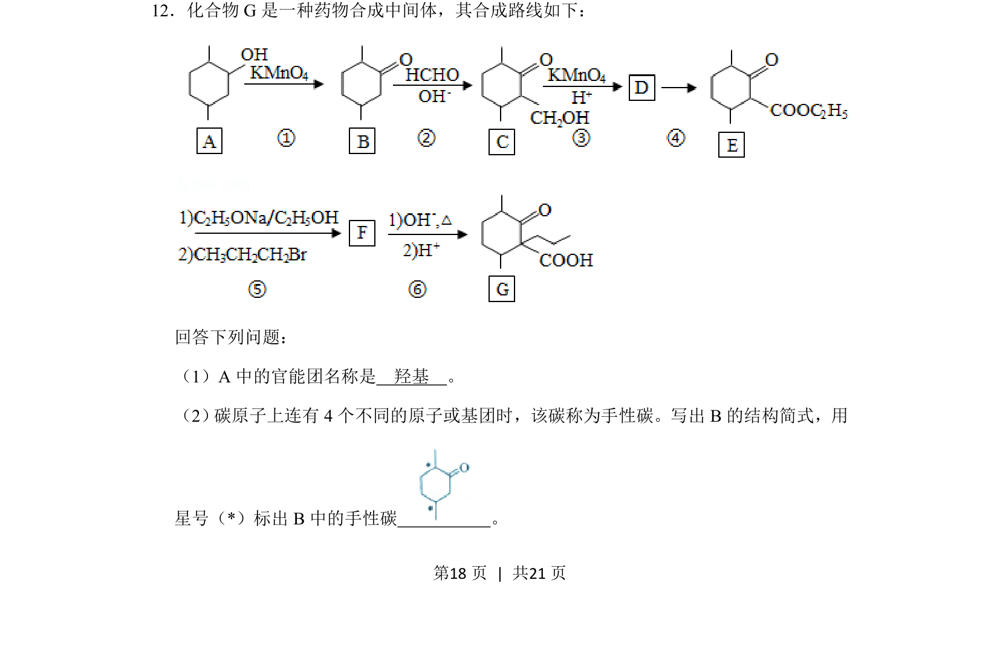
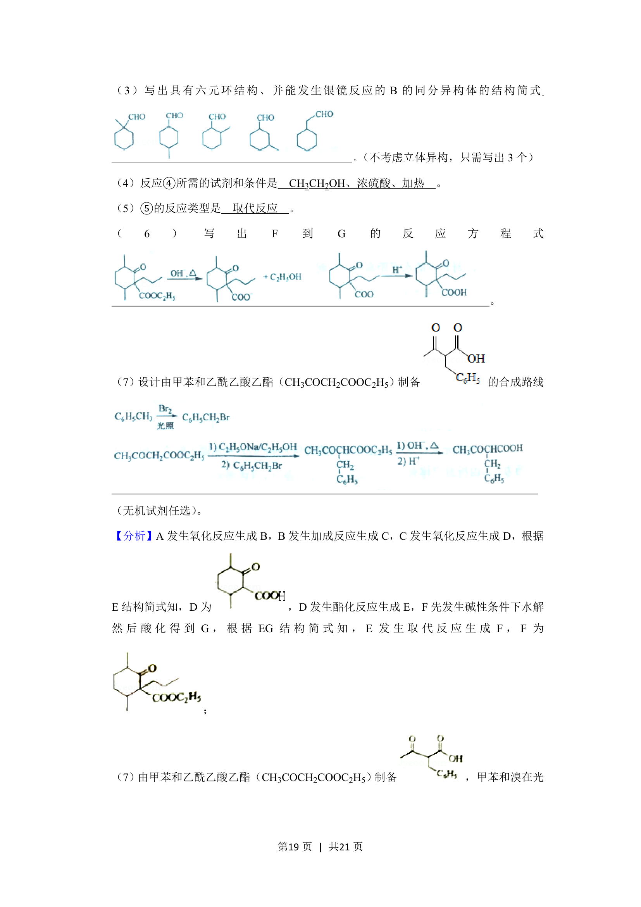
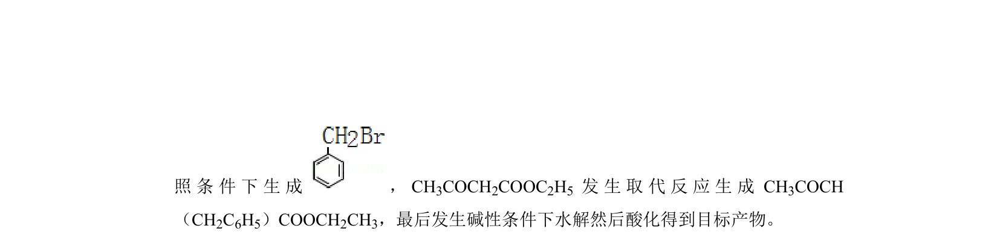
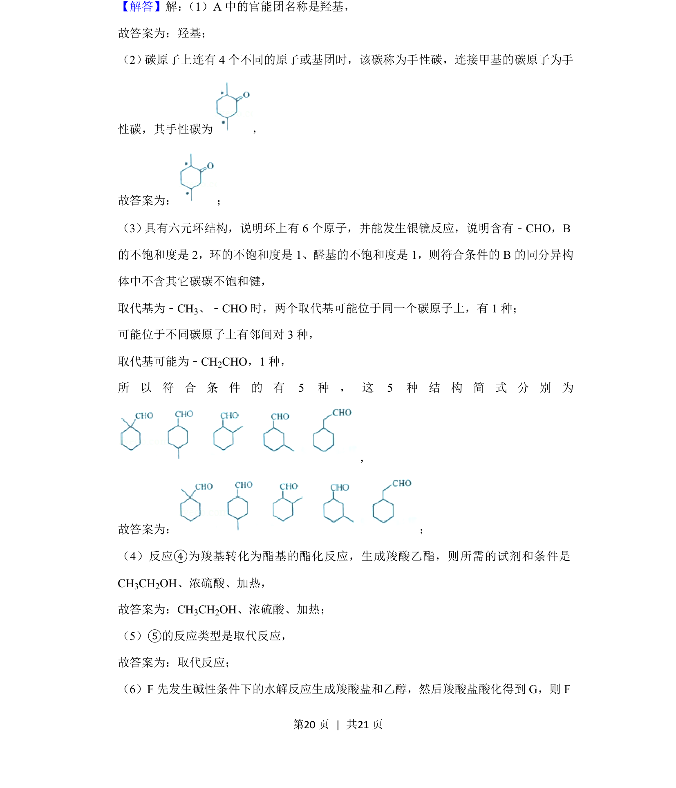
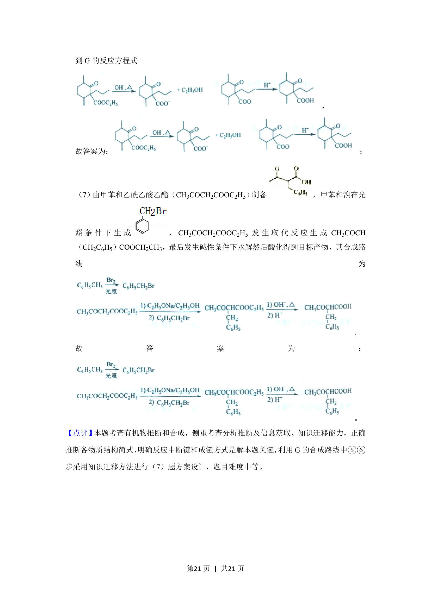

## 题面

## 摘要

有机合成路线中官能团识别与手性碳原子判断。

## 关联考点

- [[官能团名称]]
- [[692-手性碳|手性碳]]
- [[817-结构简式|结构简式]]

## 答案与解析

> 📄 原 PDF 第 18 页：`素材/真题/湖南/2008-2024·（湖南）化学高考真题/2019年高考化学试卷（新课标Ⅰ）（解析卷）.pdf`

<!-- 题干文本-start -->
## 题干文本
12．化合物G是一种药物合成中间体，其合成路线如下：
回答下列问题：
（1）A中的官能团名称是　羟基　。
（2） 碳原子上连有4个不同的原子或基团时，该碳称为手性碳。写出B的结构简式，用
星号（*）标出B中的手性碳　 　。
<!-- 题干文本-end -->

<!-- 解析文本-start -->
## 解析文本

<!-- 解析文本-end -->
