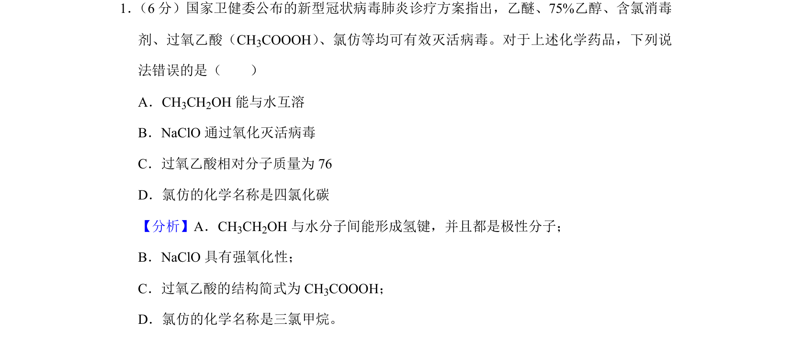
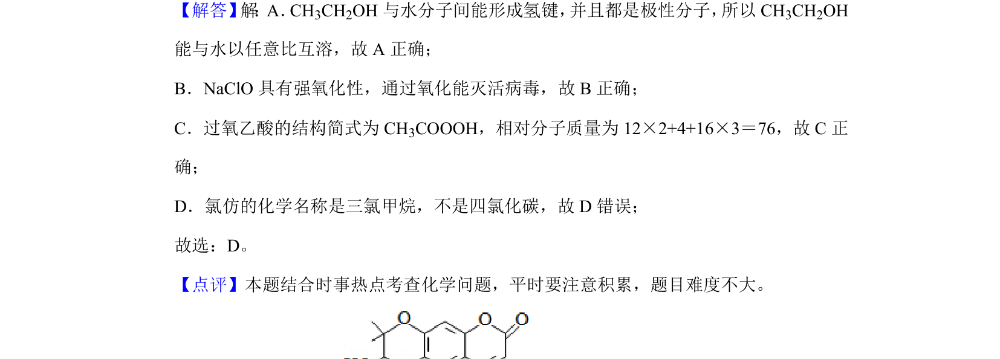

## 题面

## 摘要

结合时事热点考查常见化学药品的性质与组成

## 关联考点

- [[乙醇性质]]
- [[次氯酸钠氧化性]]
- [[相对分子质量计算]]
- [[氯仿命名]]

## 答案与解析

> 📄 原 PDF 第 1 页：`素材/真题/湖南/2008-2024·（湖南）化学高考真题/2020年高考化学试卷（新课标Ⅰ）（解析卷）.pdf`

<!-- 题干文本-start -->
## 题干文本
1． （6分）国家卫健委公布的新型冠状病毒肺炎诊疗方案指出，乙醚、75%乙醇、含氯消毒
剂、过氧乙酸（CH3COOOH） 、氯仿等均可有效灭活病毒。对于上述化学药品，下列说
法错误的是（　　）
A．CH3CH2OH能与水互溶
B．NaClO通过氧化灭活病毒
C．过氧乙酸相对分子质量为76
D．氯仿的化学名称是四氯化碳
<!-- 题干文本-end -->

<!-- 解析文本-start -->
## 解析文本
【分析】A．CH3CH2OH与水分子间能形成氢键，并且都是极性分子；
B．NaClO具有强氧化性；
C．过氧乙酸的结构简式为CH 3COOOH；
D．氯仿的化学名称是三氯甲烷。
【解答】 解 ：A．CH3CH2OH与水分子间能形成氢键， 并且都是极性分子， 所以CH3CH2OH
能与水以任意比互溶，故A正确；
B．NaClO具有强氧化性，通过氧化能灭活病毒，故B正确；
C．过氧乙酸的结构简式为CH 3COOOH，相对分子质量为12×2+4+16×3＝76，故C正
确；
D．氯仿的化学名称是三氯甲烷，不是四氯化碳，故D错误；
故选：D。
【点评】本题结合时事热点考查化学问题，平时要注意积累，题目难度不大。
<!-- 解析文本-end -->
