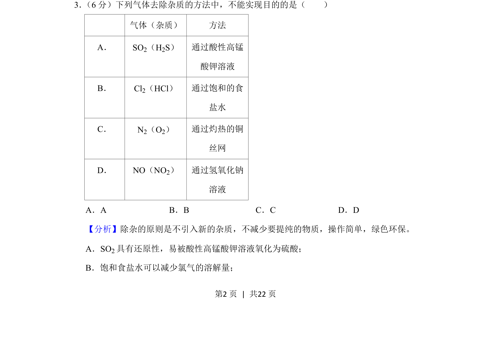
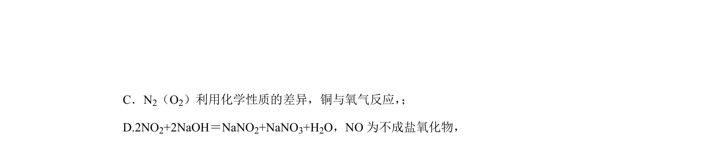
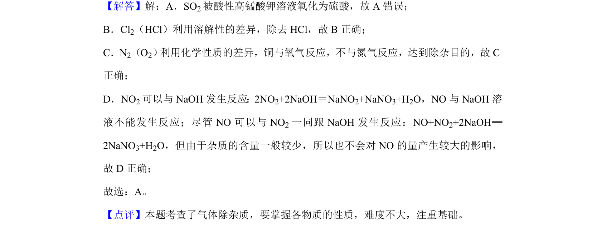

## 题面

## 摘要

考查常见气体除杂方法的选择与判断，涉及除杂原则与物质性质。

## 关联考点

- [[气体除杂]]
- [[162-氧化还原反应|氧化还原反应]]
- [[775-物质性质与处理|物质分离与提纯]]

## 答案与解析

> 📄 原 PDF 第 2 页：`素材/真题/湖南/2008-2024·（湖南）化学高考真题/2020年高考化学试卷（新课标Ⅰ）（解析卷）.pdf`
