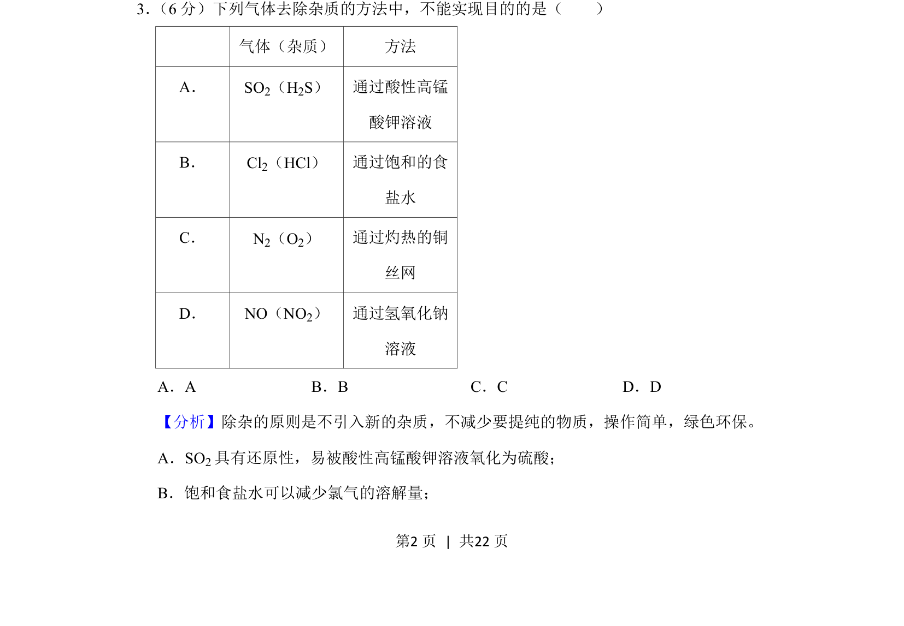
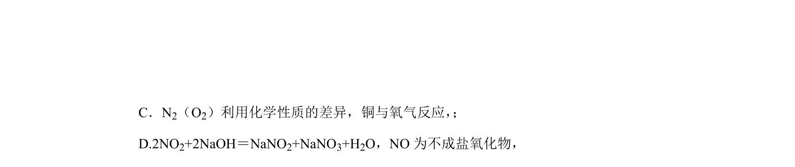
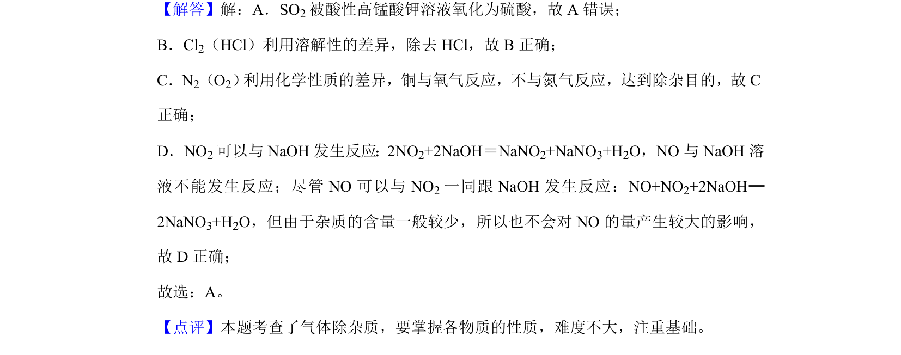

## 题面

## 摘要

考查常见气体除杂方法的选择与判断，涉及除杂原则与物质性质。

## 关联考点

- [[气体除杂]]
- [[162-氧化还原反应|氧化还原反应]]
- [[775-物质性质与处理|物质分离与提纯]]

## 答案与解析

> 📄 原 PDF 第 2 页：`素材/真题/湖南/2008-2024·（湖南）化学高考真题/2020年高考化学试卷（新课标Ⅰ）（解析卷）.pdf`

<!-- 题干文本-start -->
## 题干文本
3． （6分）下列气体去除杂质的方法中，不能实现目的的是（　　）
气体（杂质） 方法
A． SO2（H2S） 通过酸性高锰
酸钾溶液
B． Cl2（HCl） 通过饱和的食
盐水
C． N2（O2） 通过灼热的铜
丝网
D． NO（NO2） 通过氢氧化钠
溶液
A．A B．B C．C D．D
<!-- 题干文本-end -->

<!-- 解析文本-start -->
## 解析文本
【分析】除杂的原则是不引入新的杂质，不减少要提纯的物质，操作简单，绿色环保。
A．SO2具有还原性，易被酸性高锰酸钾溶液氧化为硫酸；
B．饱和食盐水可以减少氯气的溶解量；
<!-- 解析文本-end -->
