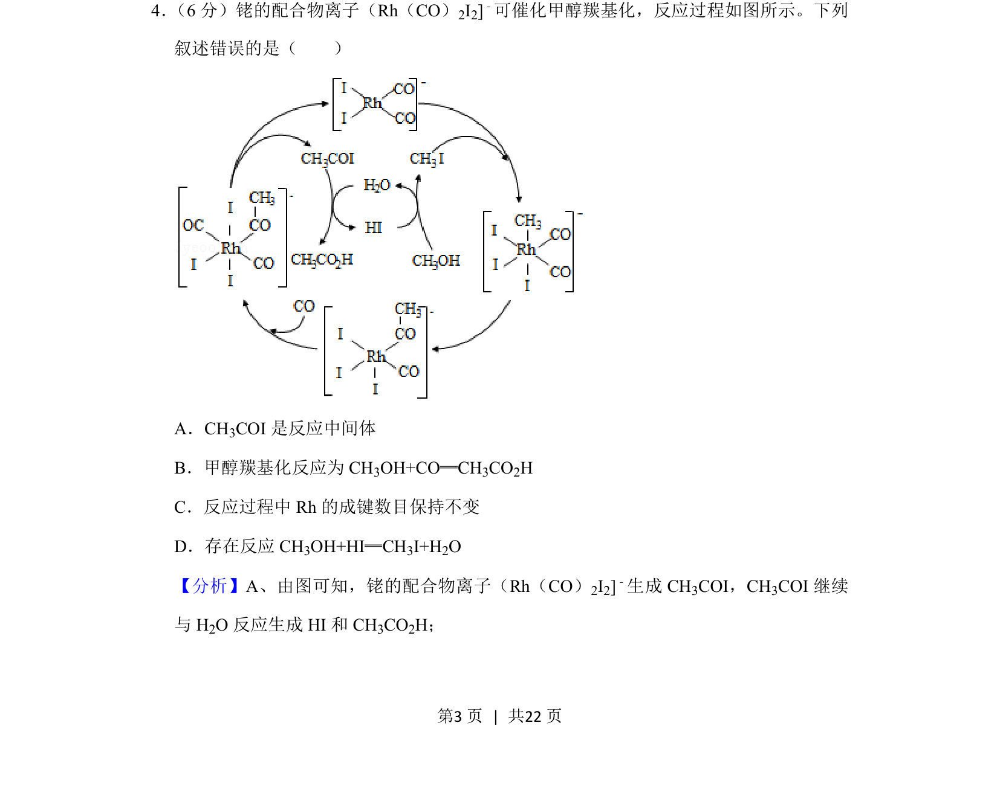
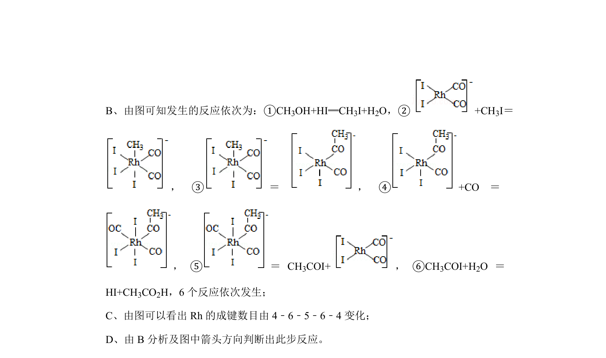
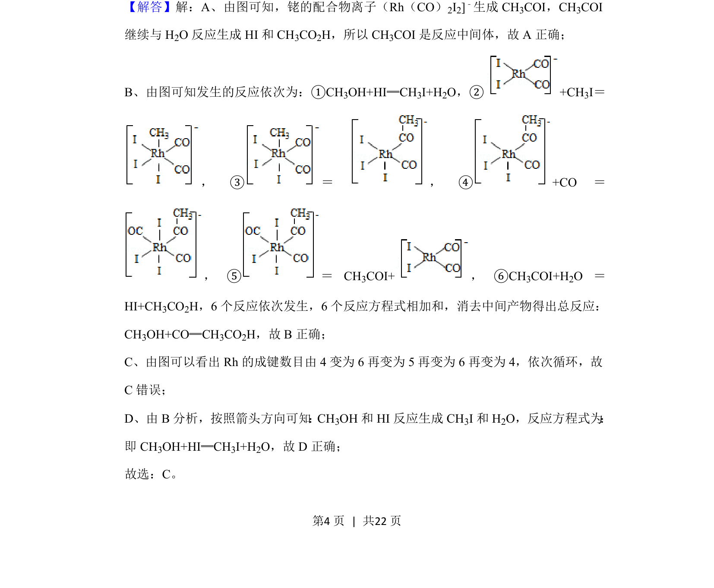
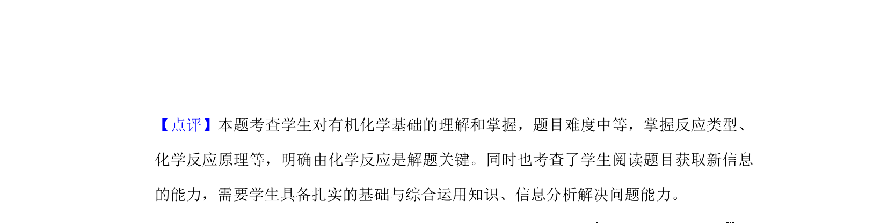

## 题面

## 摘要

该题通过铑配合物催化甲醇羰基化的反应历程图，考查对反应中间体、催化循环及成键情况的分析判断。

## 关联考点

- [[993-反应历程|反应历程]]
- [[595-催化循环|催化循环]]
- [[中间体]]
- [[441-配合物|配合物]]

## 答案与解析

> 📄 原 PDF 第 3 页：`素材/真题/湖南/2008-2024·（湖南）化学高考真题/2020年高考化学试卷（新课标Ⅰ）（解析卷）.pdf`
