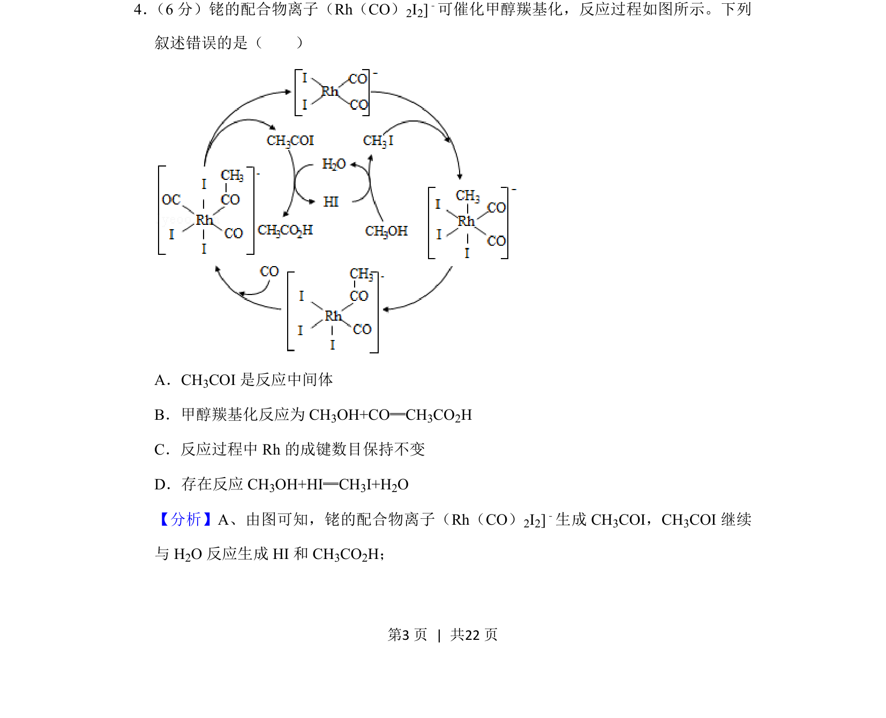
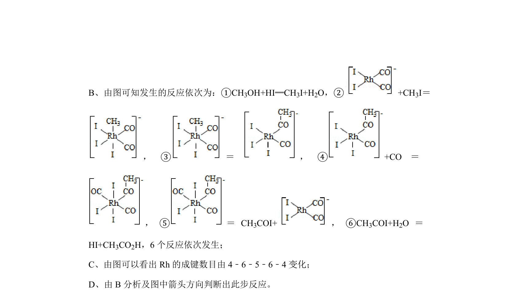
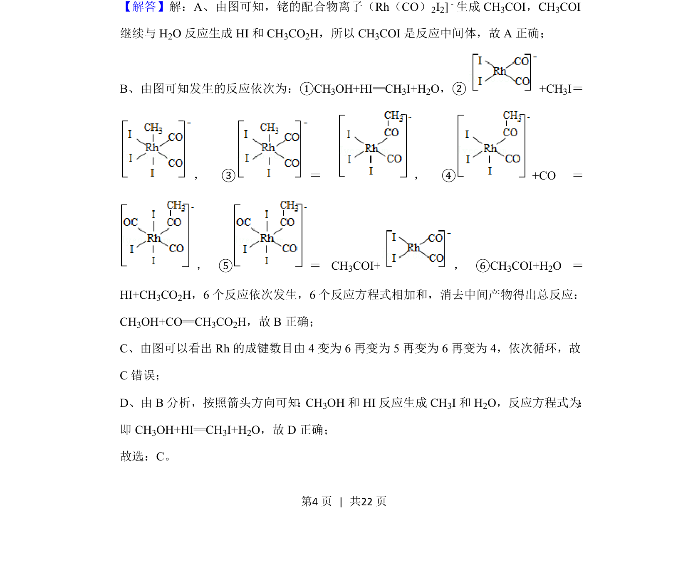
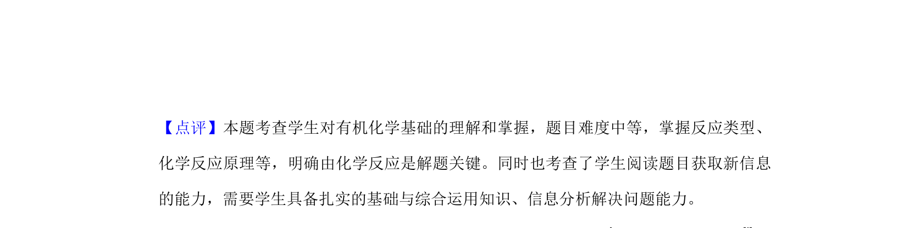

## 题面

## 摘要

该题通过铑配合物催化甲醇羰基化的反应历程图，考查对反应中间体、催化循环及成键情况的分析判断。

## 关联考点

- [[993-反应历程|反应历程]]
- [[595-催化循环|催化循环]]
- [[中间体]]
- [[441-配合物|配合物]]

## 答案与解析

> 📄 原 PDF 第 3 页：`素材/真题/湖南/2008-2024·（湖南）化学高考真题/2020年高考化学试卷（新课标Ⅰ）（解析卷）.pdf`

<!-- 题干文本-start -->
## 题干文本
4． （6分）铑的配合物离子（Rh（CO）2I2]﹣可催化甲醇羰基化，反应过程如图所示。下列
叙述错误的是（　　）
A．CH3COI是反应中间体
B．甲醇羰基化反应为CH 3OH+CO═CH3CO2H
C．反应过程中Rh的成键数目保持不变
D．存在反应CH 3OH+HI═CH3I+H2O
<!-- 题干文本-end -->

<!-- 解析文本-start -->
## 解析文本
【分析】A、由图可知，铑的配合物离子（Rh（CO） 2I2]﹣生成CH 3COI，CH3COI继续
与H 2O反应生成HI和CH 3CO2H；
<!-- 解析文本-end -->
