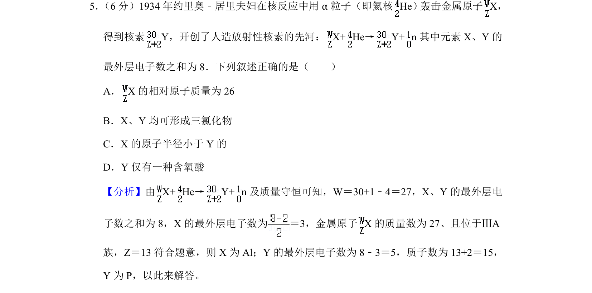
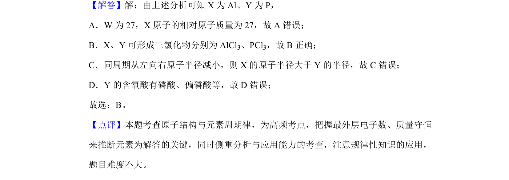

## 题面

## 摘要

通过核反应和质量守恒推断元素，考查原子结构与元素周期律的应用。

## 关联考点

- [[426-原子结构|原子结构]]
- [[252-元素周期律|元素周期律]]
- [[058-质量守恒定律|质量守恒]]
- [[431-核反应|核反应]]

## 答案与解析

> 📄 原 PDF 第 5 页：`素材/真题/湖南/2008-2024·（湖南）化学高考真题/2020年高考化学试卷（新课标Ⅰ）（解析卷）.pdf`
