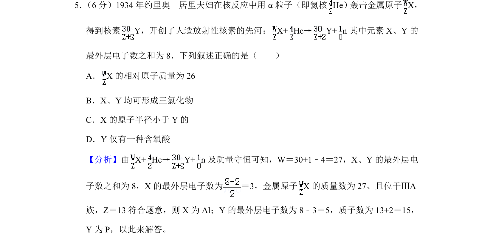
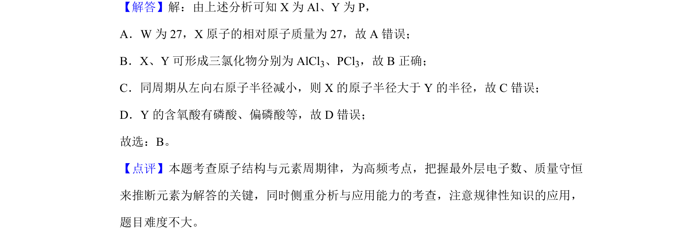

## 题面

## 摘要

通过核反应和质量守恒推断元素，考查原子结构与元素周期律的应用。

## 关联考点

- [[426-原子结构|原子结构]]
- [[252-元素周期律|元素周期律]]
- [[058-质量守恒定律|质量守恒]]
- [[431-核反应|核反应]]

## 答案与解析

> 📄 原 PDF 第 5 页：`素材/真题/湖南/2008-2024·（湖南）化学高考真题/2020年高考化学试卷（新课标Ⅰ）（解析卷）.pdf`

<!-- 题干文本-start -->
## 题干文本
5． （6分）1934年约里奥﹣居里夫妇在核反应中用α粒子（即氦核He）轰击金属原子X，
得到核素Y，开创了人造放射性核素的先河：X+ He→Y+ n其中元素X、Y的
最外层电子数之和为8．下列叙述正确的是（　　）
A．X的相对原子质量为26
B．X、Y均可形成三氯化物
C．X的原子半径小于Y的
D．Y仅有一种含氧酸
<!-- 题干文本-end -->

<!-- 解析文本-start -->
## 解析文本
【分析】由X+ He→Y+ n及质量守恒可知，W＝30+1﹣4＝27，X、Y的最外层电
子数之和为8，X的最外层电子数为 ＝3，金属原子X的质量数为27、且位于ⅢA
族，Z＝13符合题意，则X为Al；Y的最外层电子数为8﹣3＝5，质子数为13+2＝15，
Y为P，以此来解答。
【解答】解：由上述分析可知X为Al、Y为P，
A．W为27，X原子的相对原子质量为27，故A错误；
B．X、Y可形成三氯化物分别为AlCl 3、PCl3，故B正确；
C．同周期从左向右原子半径减小，则X的原子半径大于Y的半径，故C错误；
D．Y的含氧酸有磷酸、偏磷酸等，故D错误；
故选：B。
【点评】本题考查原子结构与元素周期律，为高频考点，把握最外层电子数、质量守恒
来推断元素为解答的关键，同时侧重分析与应用能力的考查，注意规律性知识的应用，
题目难度不大。
<!-- 解析文本-end -->
