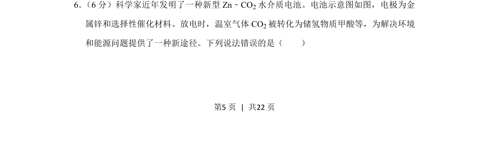
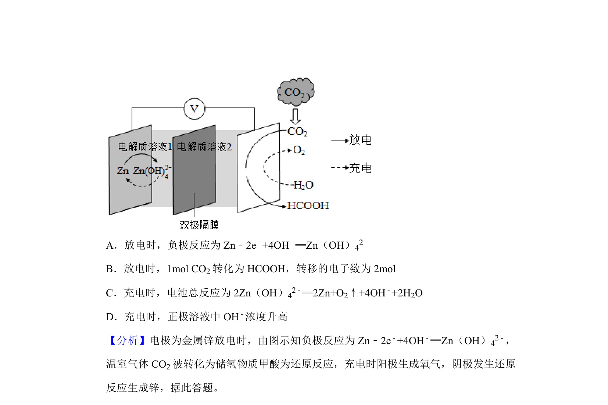
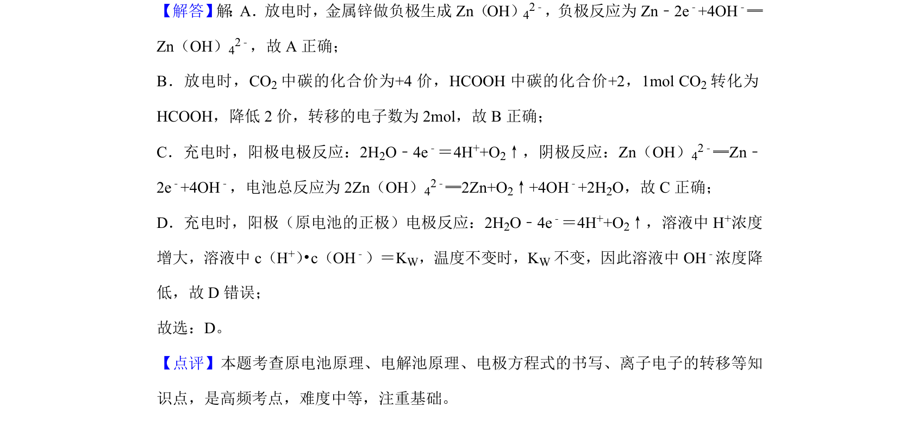

## 题面

## 摘要

考查Zn-CO2水介质电池工作原理，需判断电极反应、离子迁移及产物转化的正误。

## 关联考点

- [[287-原电池|原电池]]
- [[793-电极反应|电极反应]]
- [[564-离子迁移|离子迁移]]
- [[625-化学电源新型电池|新型化学电源]]

## 答案与解析

> 📄 原 PDF 第 5 页：`素材/真题/湖南/2008-2024·（湖南）化学高考真题/2020年高考化学试卷（新课标Ⅰ）（解析卷）.pdf`
