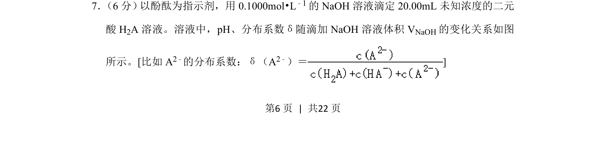
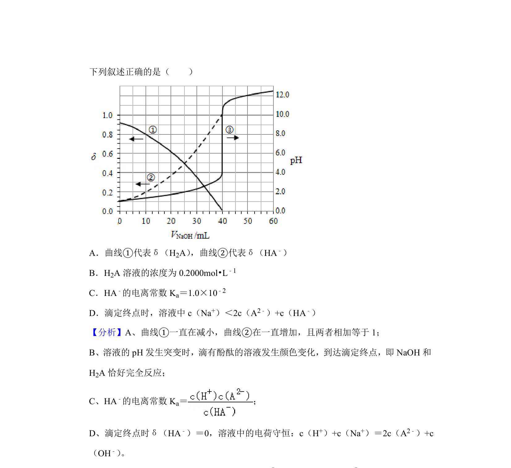
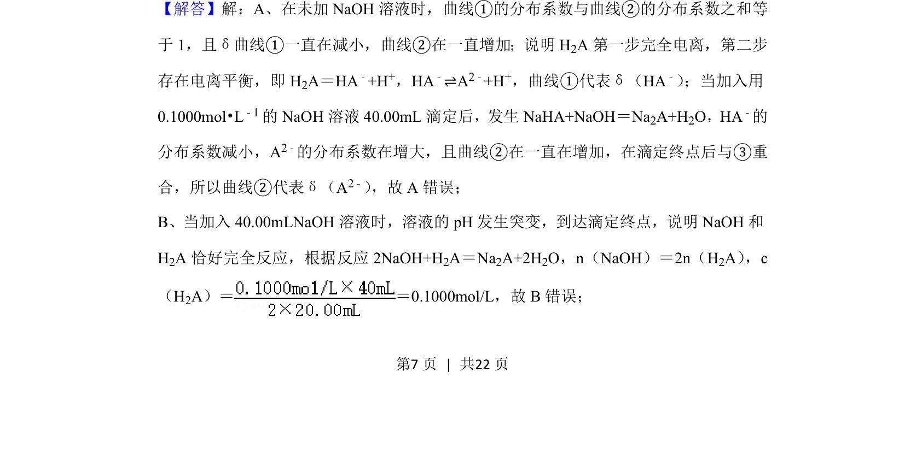
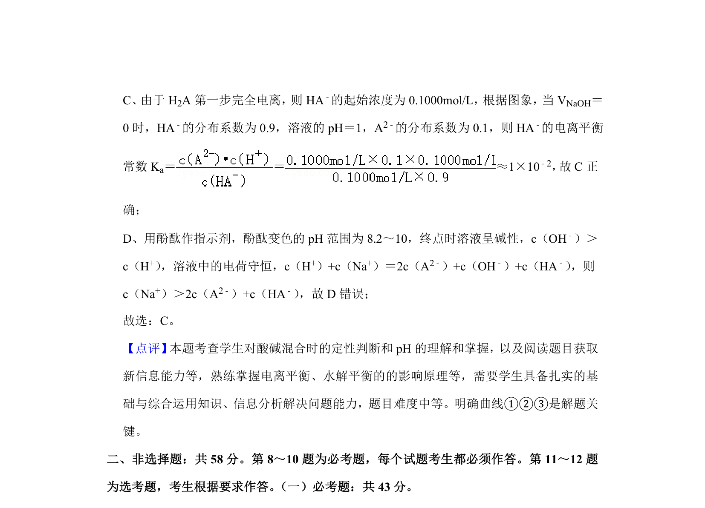

## 题面

## 摘要

考查NaOH滴定未知浓度二元酸，通过pH与分布系数曲线分析滴定过程。

## 关联考点

- [[340-酸碱中和滴定|酸碱中和滴定]]
- [[分布系数]]
- [[二元酸]]
- [[150-酸碱指示剂|指示剂]]

## 答案与解析

> 📄 原 PDF 第 6 页：`素材/真题/湖南/2008-2024·（湖南）化学高考真题/2020年高考化学试卷（新课标Ⅰ）（解析卷）.pdf`
