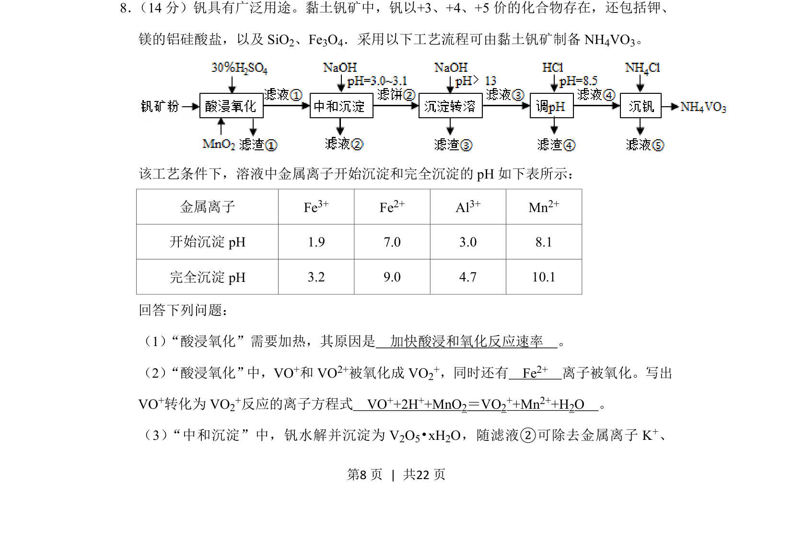
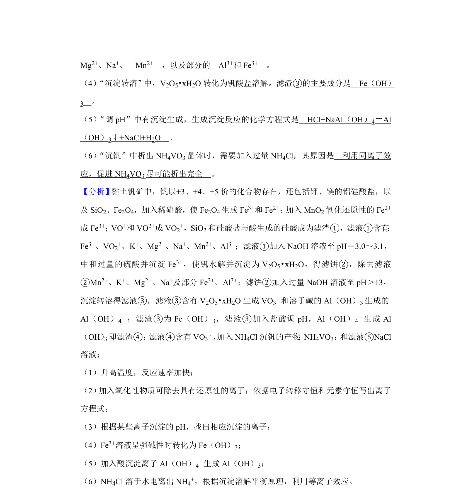
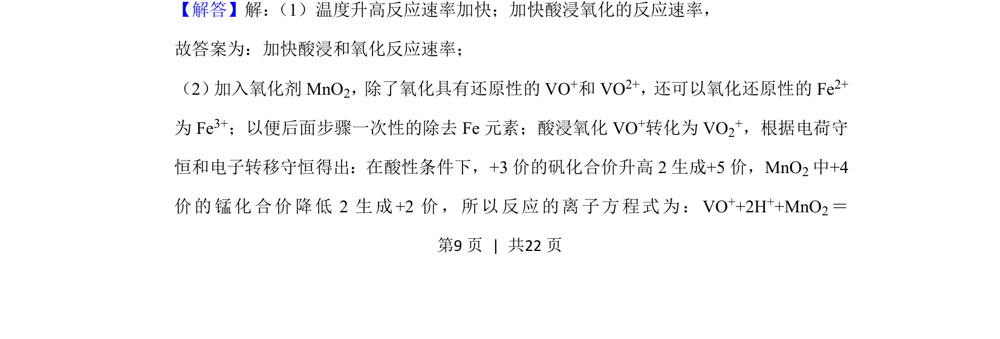
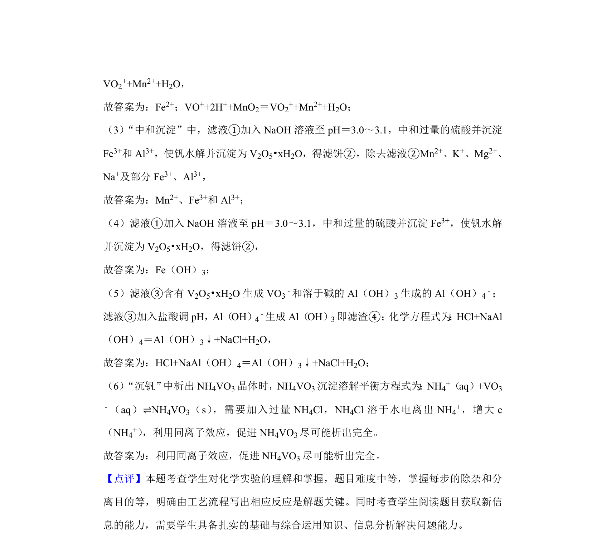

## 题面

## 摘要

考查黏土钒矿制备NH4VO3的工艺流程，涉及氧化还原、离子方程式及pH控制除杂。

## 关联考点

- [[680-工艺流程分析|工艺流程分析]]
- [[162-氧化还原反应|氧化还原反应]]
- [[806-离子方程式书写|离子方程式书写]]
- [[沉淀pH调控]]

## 答案与解析

> 📄 原 PDF 第 8 页：`素材/真题/湖南/2008-2024·（湖南）化学高考真题/2020年高考化学试卷（新课标Ⅰ）（解析卷）.pdf`
