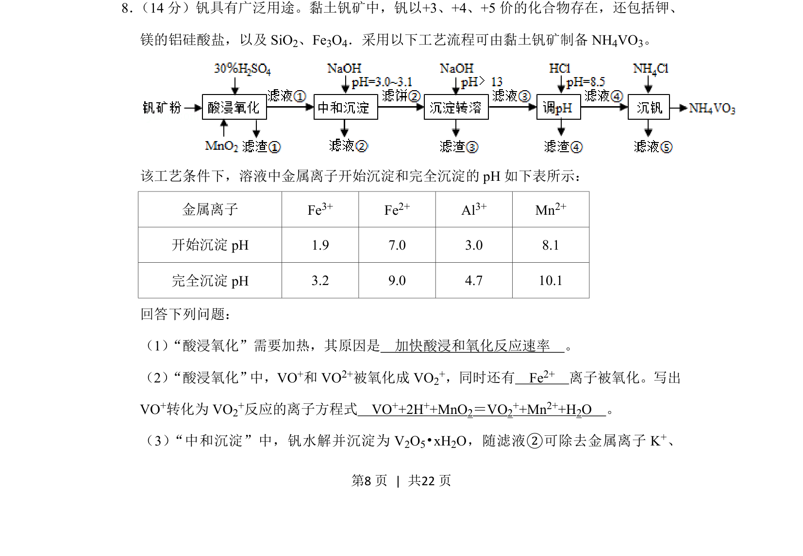
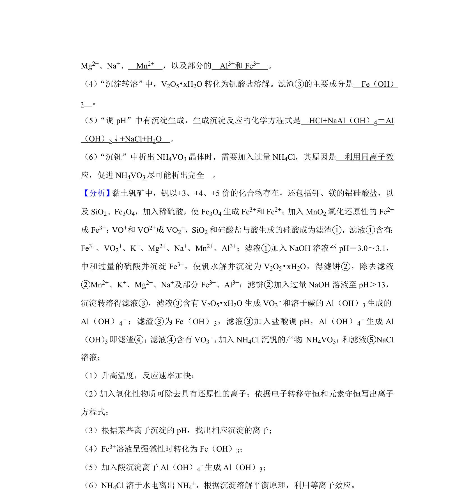
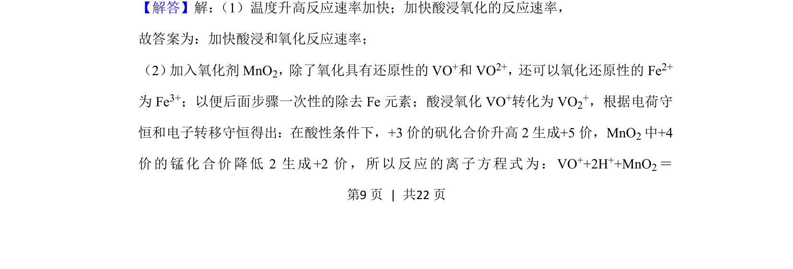
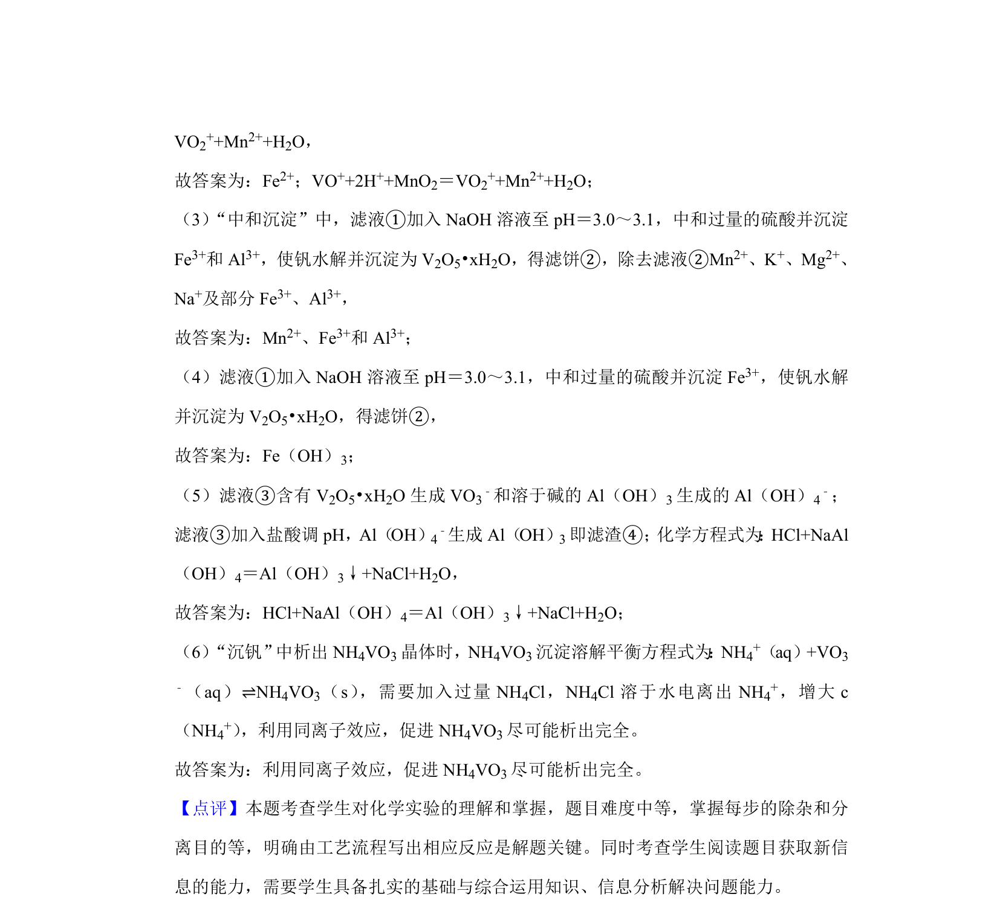

## 题面

## 摘要

考查黏土钒矿制备NH4VO3的工艺流程，涉及氧化还原、离子方程式及pH控制除杂。

## 关联考点

- [[680-工艺流程分析|工艺流程分析]]
- [[162-氧化还原反应|氧化还原反应]]
- [[807-离子方程式的书写|离子方程式书写]]
- [[沉淀pH调控]]

## 答案与解析

> 📄 原 PDF 第 8 页：`素材/真题/湖南/2008-2024·（湖南）化学高考真题/2020年高考化学试卷（新课标Ⅰ）（解析卷）.pdf`

<!-- 题干文本-start -->
## 题干文本
8． （14分）钒具有广泛用途。黏土钒矿中，钒以+3、+4、+5价的化合物存在，还包括钾、
镁的铝硅酸盐，以及SiO 2、Fe3O4．采用以下工艺流程可由黏土钒矿制备NH 4VO3。
该工艺条件下，溶液中金属离子开始沉淀和完全沉淀的pH如下表所示：
金属离子 Fe3+ Fe2+ Al3+ Mn2+
开始沉淀pH 1.9 7.0 3.0 8.1
完全沉淀pH 3.2 9.0 4.7 10.1
回答下列问题：
（1）“酸浸氧化”需要加热，其原因是　加快酸浸和氧化反应速率　。
（2）“酸浸氧化”中，VO+和VO 2+被氧化成VO 2+，同时还有　Fe2+　离子被氧化。写出
VO+转化为VO 2+反应的离子方程式　VO++2H++MnO2＝VO2++Mn2++H2O　。
（3）“中和沉淀”中，钒水解并沉淀为V 2O5•xH2O，随滤液②可除去金属离子K +、
<!-- 题干文本-end -->

<!-- 解析文本-start -->
## 解析文本

<!-- 解析文本-end -->
