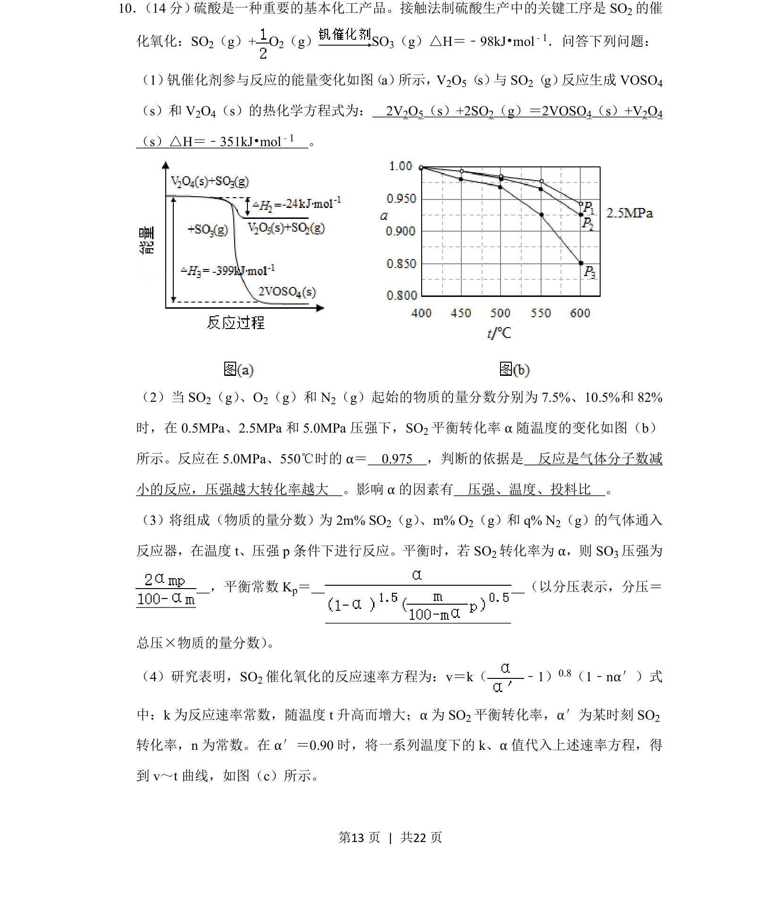
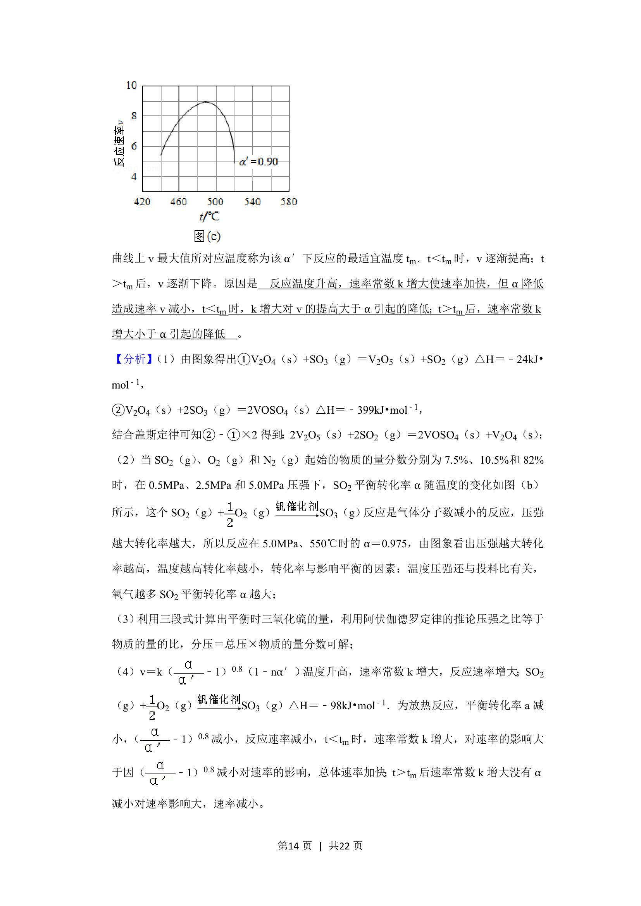
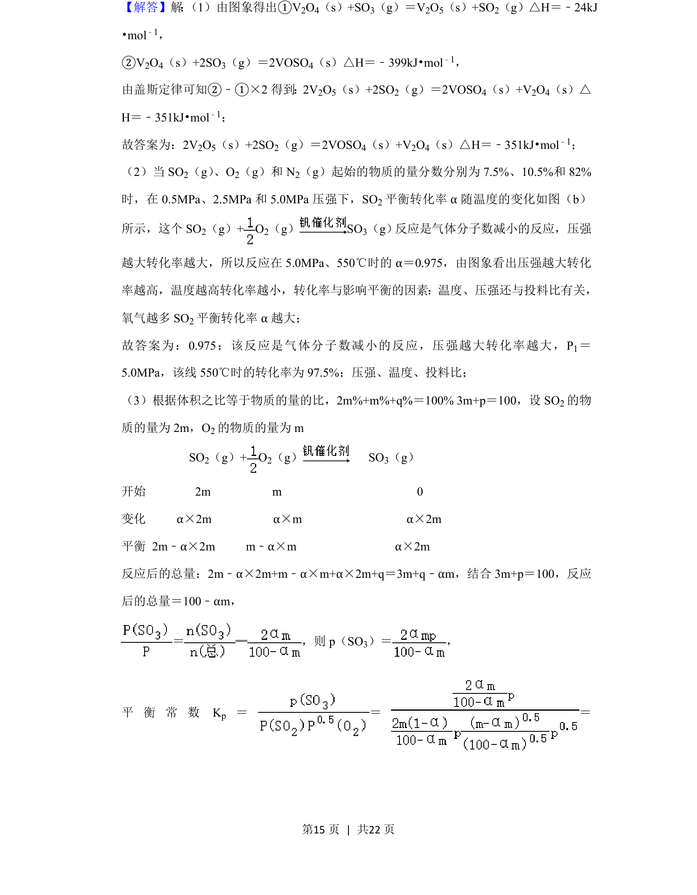
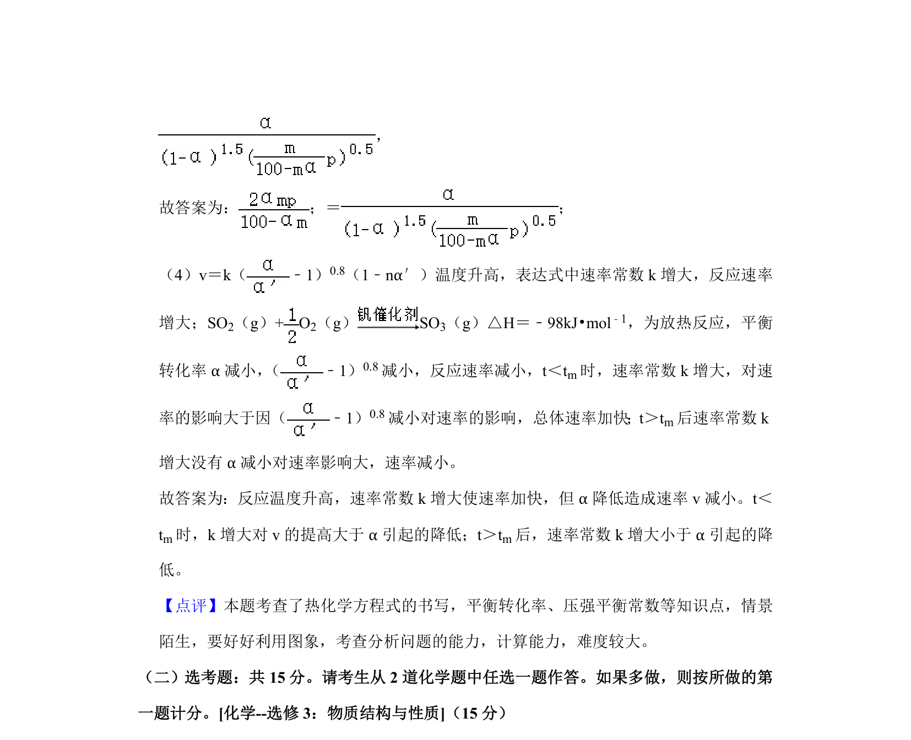

## 题面

## 摘要

考查接触法制硫酸中SO2催化氧化的热化学、平衡转化率、分压平衡常数及反应速率分析。

## 关联考点

- [[309-热化学方程式|热化学方程式]]
- [[化学平衡转化率]]
- [[分压平衡常数]]
- [[反应速率方程]]

## 答案与解析

> 📄 原 PDF 第 13 页：`素材/真题/湖南/2008-2024·（湖南）化学高考真题/2020年高考化学试卷（新课标Ⅰ）（解析卷）.pdf`
