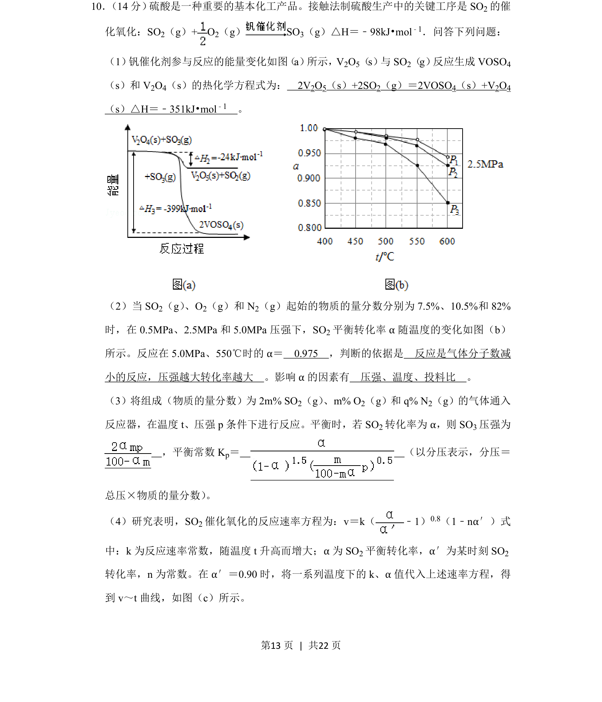
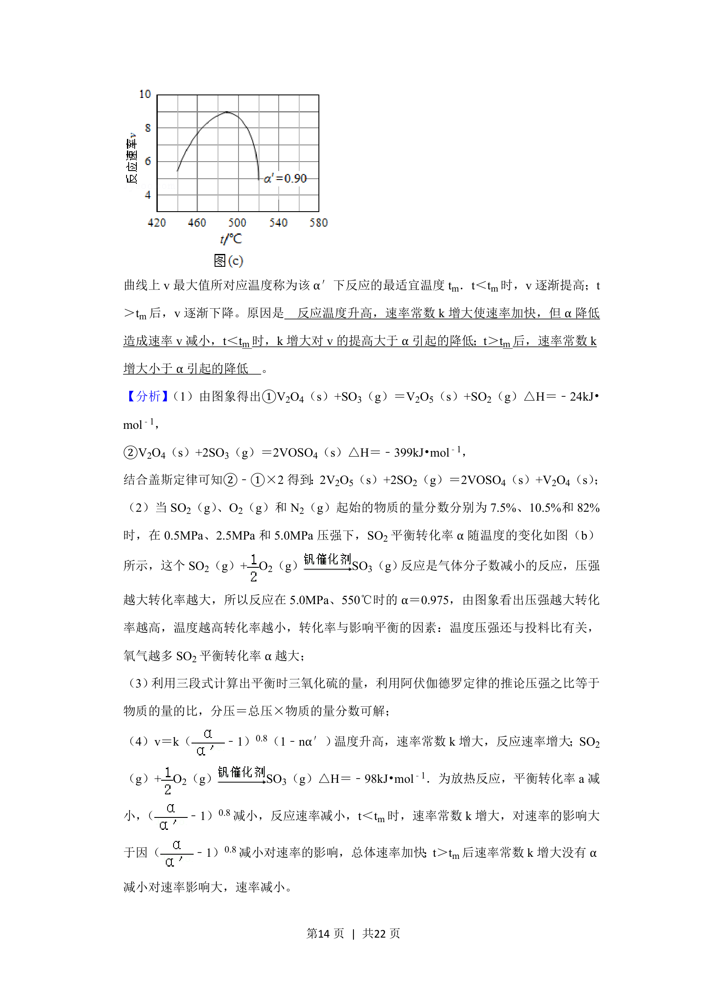
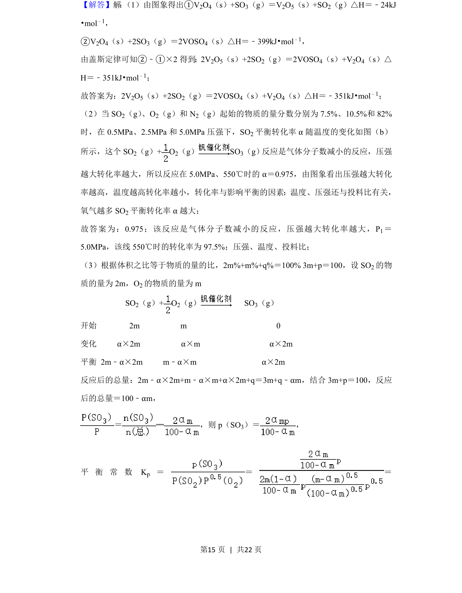
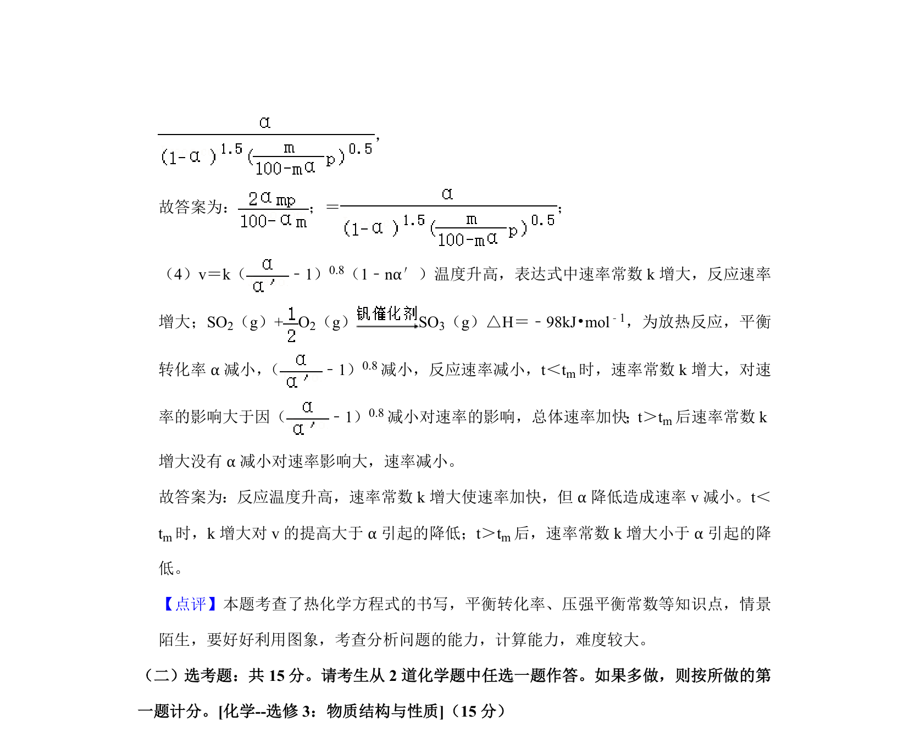

## 题面

## 摘要

考查接触法制硫酸中SO2催化氧化的热化学、平衡转化率、分压平衡常数及反应速率分析。

## 关联考点

- [[309-热化学方程式|热化学方程式]]
- [[化学平衡转化率]]
- [[分压平衡常数]]
- [[反应速率方程]]

## 答案与解析

> 📄 原 PDF 第 13 页：`素材/真题/湖南/2008-2024·（湖南）化学高考真题/2020年高考化学试卷（新课标Ⅰ）（解析卷）.pdf`

<!-- 题干文本-start -->
## 题干文本
10． （14分） 硫酸是一种重要的基本化工产品。接触法制硫酸生产中的关键工序是SO2的催
化氧化：SO2（g）+ O 2（g）SO 3（g）△H＝﹣98kJ•mol﹣1．问答下列问题：
（1） 钒催化剂参与反应的能量变化如图（a） 所示，V2O5（s） 与SO2（g） 反应生成VOSO4
（s）和V 2O4（s）的热化学方程式为：　2V2O5（s）+2SO2（g）＝2VOSO4（s）+V2O4
（s）△H＝﹣351kJ•mol﹣1　。
（2）当SO 2（g） 、O2（g）和N 2（g）起始的物质的量分数分别为7.5%、10.5%和82%
时，在0.5MPa、2.5MPa和5.0MPa压强下，SO 2平衡转化率α随温度的变化如图（b）
所示。反应在5.0MPa、550℃时的α＝　0.975　，判断的依据是　反应是气体分子数减
小的反应，压强越大转化率越大　。影响α的因素有　压强、温度、投料比　。
（3）将组成（物质的量分数）为2m% SO2（g） 、m% O2（g）和q% N 2（g）的气体通入
反应器，在温度t、压强p条件下进行反应。平衡时，若SO 2转化率为α，则SO 3压强为　
　，平衡常数K p＝　 　（以分压表示，分压＝
总压×物质的量分数） 。
（4）研究表明，SO2催化氧化的反应速率方程为：v＝k（ ﹣1） 0.8（1﹣nα′）式
中：k为反应速率常数，随温度t升高而增大；α为SO 2平衡转化率，α′为某时刻SO 2
转化率，n为常数。在α′＝0.90时，将一系列温度下的k、α值代入上述速率方程，得
到v～t曲线，如图（c）所示。
<!-- 题干文本-end -->

<!-- 解析文本-start -->
## 解析文本

<!-- 解析文本-end -->
