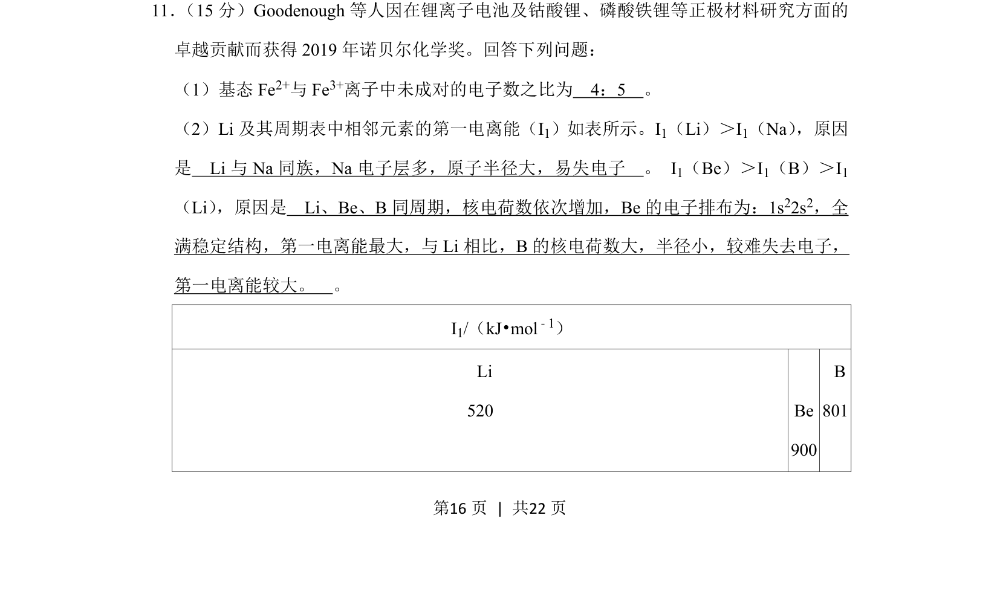
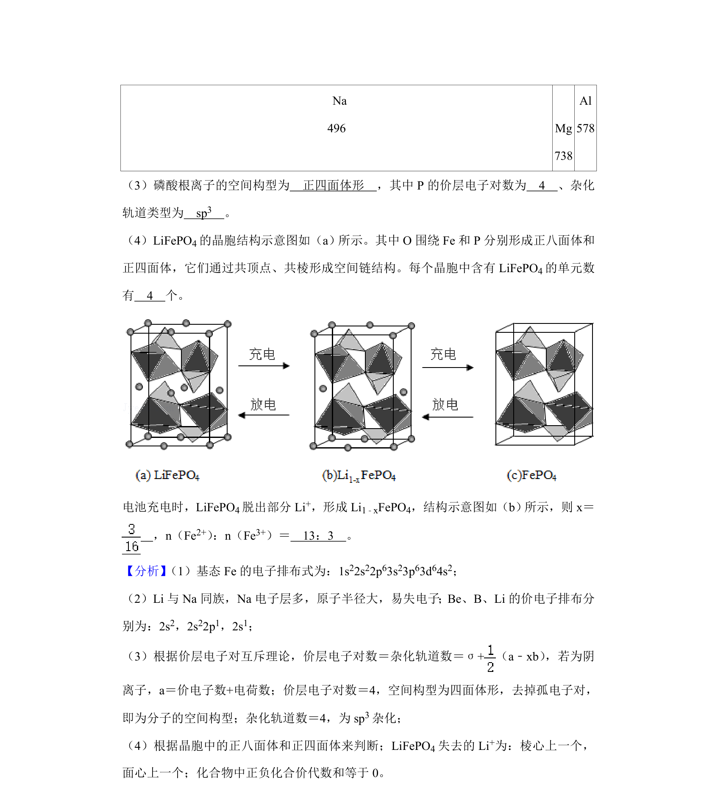
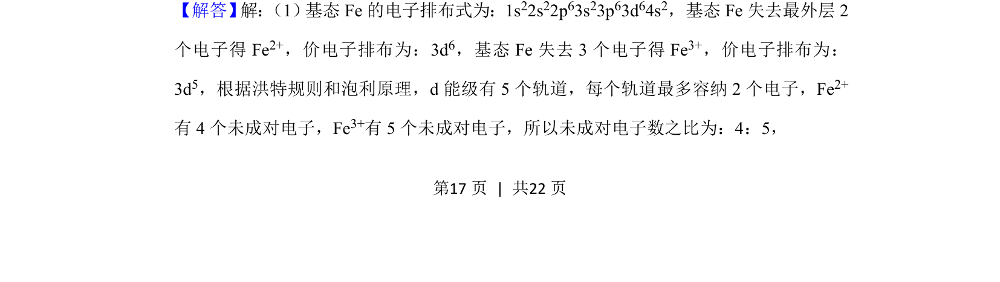
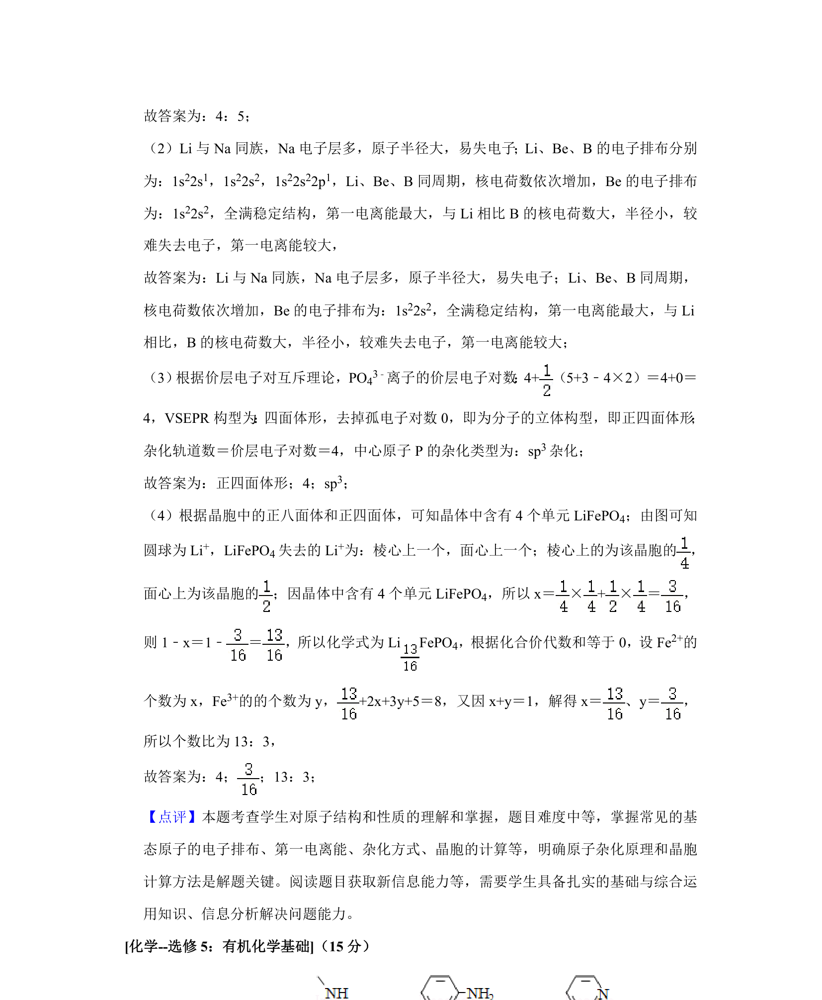

## 题面

## 摘要

考查基态Fe²⁺/Fe³⁺未成对电子数及Li、Be、B第一电离能递变规律解释。

## 关联考点

- [[790-电子排布|电子排布]]
- [[未成对电子]]
- [[393-第一电离能|第一电离能]]
- [[252-元素周期律|元素周期律]]

## 答案与解析

> 📄 原 PDF 第 16 页：`素材/真题/湖南/2008-2024·（湖南）化学高考真题/2020年高考化学试卷（新课标Ⅰ）（解析卷）.pdf`

<!-- 题干文本-start -->
## 题干文本
11． （15分）Goodenough等人因在锂离子电池及钴酸锂、磷酸铁锂等正极材料研究方面的
卓越贡献而获得2019年诺贝尔化学奖。回答下列问题：
（1）基态Fe 2+与Fe 3+离子中未成对的电子数之比为　4：5　。
（2）Li及其周期表中相邻元素的第一电离能（I 1）如表所示。I1（Li）＞I1（Na） ，原因
是　Li与Na同族，Na电子层多，原子半径大，易失电子　。 I 1（Be）＞I1（B）＞I1
（Li） ，原因是　Li、Be、B同周期，核电荷数依次增加，Be的电子排布为：1s22s2，全
满稳定结构，第一电离能最大，与Li相比，B的核电荷数大，半径小，较难失去电子，
第一电离能较大。　。
I1/（kJ•mol﹣1）
 Li
520
 
Be
900
 B
801
<!-- 题干文本-end -->

<!-- 解析文本-start -->
## 解析文本

<!-- 解析文本-end -->
