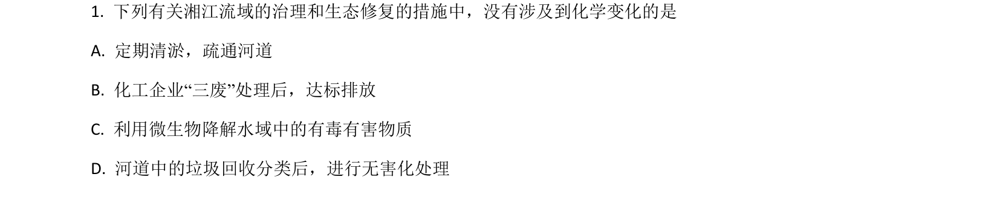
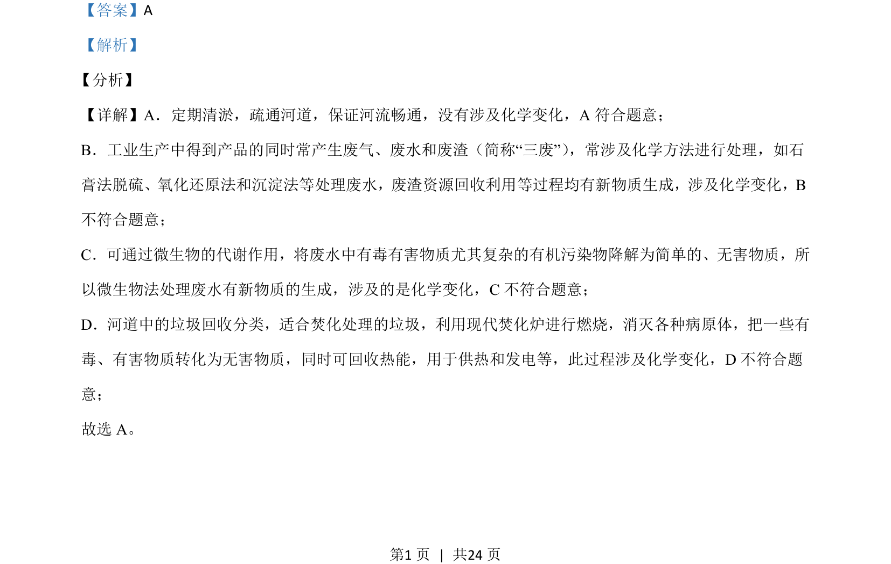

## 题面

## 摘要

本题考查物理变化与化学变化的辨析，通过常见环保措施判断是否涉及化学变化。

## 关联考点

- [[1000-物理变化与化学变化|物理变化与化学变化]]
- [[三废处理]]

## 答案与解析

> 📄 原 PDF 第 1 页：`素材/真题/湖南/2008-2024·（湖南）化学高考真题/2021年高考化学试卷（湖南）（解析卷）.pdf`

<!-- 题干文本-start -->
## 题干文本
1. 下列有关湘江流域的治理和生态修复的措施中，没有涉及到化学变化的是
A. 定期清淤，疏通河道
B. 化工企业“三废”处理后，达标排放
C. 利用微生物降解水域中的有毒有害物质
D. 河道中的垃圾回收分类后，进行无害化处理
<!-- 题干文本-end -->

<!-- 解析文本-start -->
## 解析文本
【答案】A
【解析】
分析】
【详解】A．定期清淤，疏通河道，保证河流畅通，没有涉及化学变化，A 符合题意；
B．工业生产中得到产品的同时常产生废气、废水和废渣（简称“三废”） ，常涉及化学方法进行处理，如石
膏法脱硫、氧化还原法和沉淀法等处理废水，废渣资源回收利用等过程均有新物质生成，涉及化学变化，B
不符合题意；
C．可通过微生物的代谢作用，将废水中有毒有害物质尤其复杂的有机污染物降解为简单的、无害物质，所
以微生物法处理废水有新物质的生成，涉及的是化学变化，C不符合题意；
D．河道中的垃圾回收分类，适合焚化处理的垃圾，利用现代焚化炉进行燃烧，消灭各种病原体，把一些有
毒、有害物质转化为无害物质，同时可回收热能，用于供热和发电等，此过程涉及化学变化，D 不符合题
意；
故选 A。
【
<!-- 解析文本-end -->
