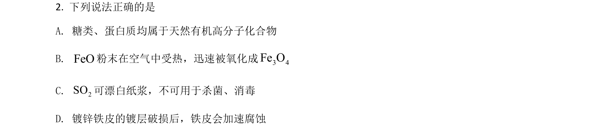
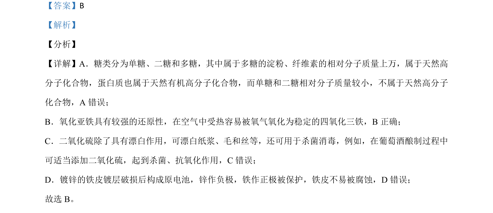

## 题面

## 摘要

该题考查常见无机物性质、有机物分类、化学实验基本操作及电化学防护，涉及物质判断与实验设计正误分析。

## 关联考点

- [[糖类与天然高分子]]
- [[氧化亚铁还原性]]
- [[二氧化硫漂白与抗氧化]]
- [[镀锌铁皮电化学防护]]
- [[实验设计与物质检验]]

## 答案与解析

> 📄 原 PDF 第 2 页：`素材/真题/湖南/2008-2024·（湖南）化学高考真题/2021年高考化学试卷（湖南）（解析卷）.pdf`
