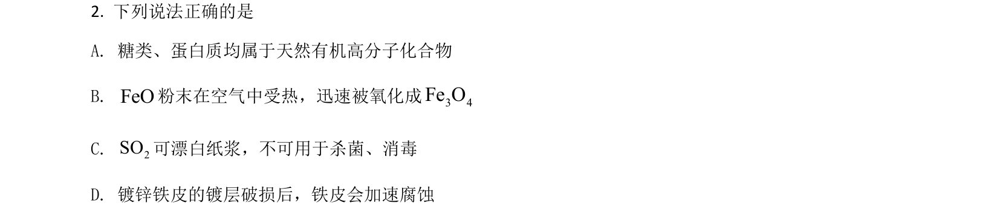
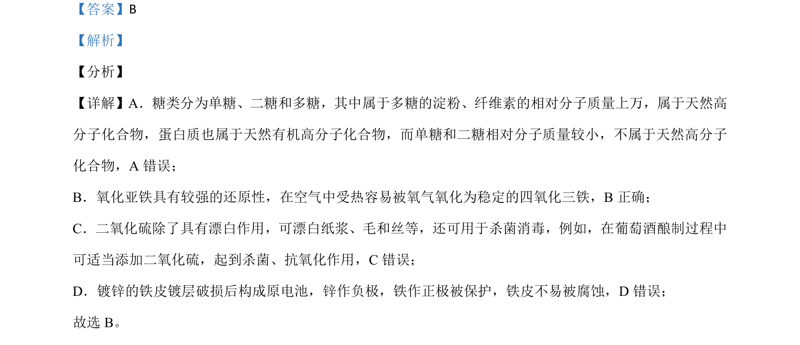

## 题面

## 摘要

该题考查常见无机物性质、有机物分类、化学实验基本操作及电化学防护，涉及物质判断与实验设计正误分析。

## 关联考点

- [[糖类与天然高分子]]
- [[氧化亚铁还原性]]
- [[二氧化硫漂白与抗氧化]]
- [[镀锌铁皮电化学防护]]
- [[实验设计与物质检验]]

## 答案与解析

> 📄 原 PDF 第 2 页：`素材/真题/湖南/2008-2024·（湖南）化学高考真题/2021年高考化学试卷（湖南）（解析卷）.pdf`

<!-- 题干文本-start -->
## 题干文本
2. 下列说法正确的是
A. 糖类、蛋白质均属于天然有机高分子化合物
B. FeO粉末在空气中受热，迅速被氧化成3 4Fe O
C. 2SO可漂白纸浆，不可用于杀菌、消毒
D. 镀锌铁皮的镀层破损后，铁皮会加速腐蚀
<!-- 题干文本-end -->

<!-- 解析文本-start -->
## 解析文本
【答案】B
【解析】
【分析】
【详解】A．糖类分为单糖、二糖和多糖，其中属于多糖的淀粉、纤维素的相对分子质量上万，属于天然高
分子化合物，蛋白质也属于天然有机高分子化合物，而单糖和二糖相对分子质量较小，不属于天然高分子
化合物，A 错误；
B．氧化亚铁具有较强的还原性，在空气中受热容易被氧气氧化为稳定的四氧化三铁，B正确；
C．二氧化硫除了具有漂白作用，可漂白纸浆、毛和丝等，还可用于杀菌消毒，例如，在葡萄酒酿制过程中
可适当添加二氧化硫，起到杀菌、抗氧化作用，C错误；
D．镀锌的铁皮镀层破损后构成原电池，锌作负极，铁作正极被保护，铁皮不易被腐蚀，D 错误；
故选 B。
<!-- 解析文本-end -->
