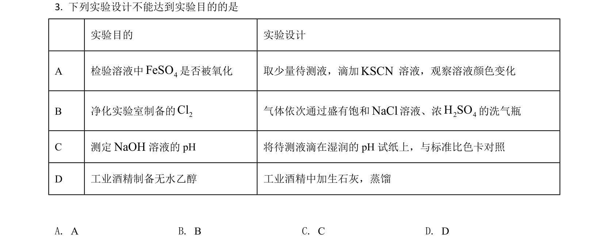
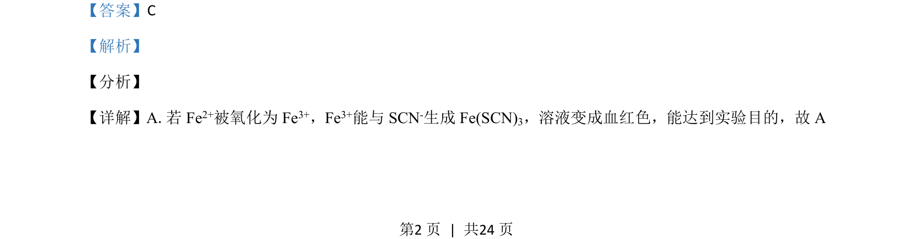
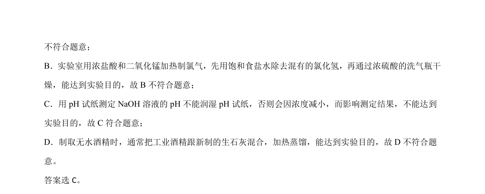

## 题面

## 摘要

考查化学实验基本操作，包括离子检验、气体制备及除杂、pH测定等。

## 关联考点

- [[Fe3+的检验]]
- [[氯气的实验室制备与净化]]
- [[pH试纸的使用]]
- [[079-蒸馏|蒸馏]]

## 答案与解析

> 📄 原 PDF 第 2 页：`素材/真题/湖南/2008-2024·（湖南）化学高考真题/2021年高考化学试卷（湖南）（解析卷）.pdf`
