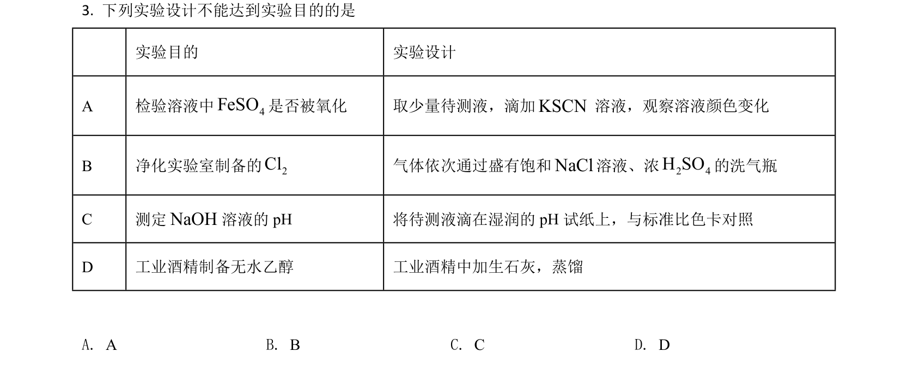
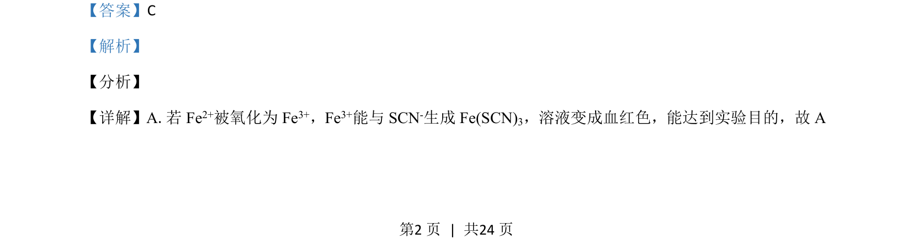
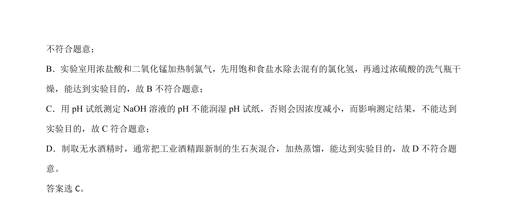

## 题面

## 摘要

考查化学实验基本操作，包括离子检验、气体制备及除杂、pH测定等。

## 关联考点

- [[Fe3+的检验]]
- [[氯气的实验室制备与净化]]
- [[pH试纸的使用]]
- [[079-蒸馏|蒸馏]]

## 答案与解析

> 📄 原 PDF 第 2 页：`素材/真题/湖南/2008-2024·（湖南）化学高考真题/2021年高考化学试卷（湖南）（解析卷）.pdf`

<!-- 题干文本-start -->
## 题干文本
3. 下列实验设计不能达到实验目的的是
实验目的 实验设计
A 检验溶液中 4FeSO是否被氧化 取少量待测液，滴加KSCN 溶液，观察溶液颜色变化
B 净化实验室制备的2Cl气体依次通过盛有饱和NaCl溶液、浓2 4H SO的洗气瓶
C 测定NaOH溶液的 pH 将待测液滴在湿润的 pH 试纸上，与标准比色卡对照
D 工业酒精制备无水乙醇 工业酒精中加生石灰，蒸馏
A. A B. B C. C D. D
<!-- 题干文本-end -->

<!-- 解析文本-start -->
## 解析文本
【答案】C
【解析】
【分析】
【详解】A.若 Fe2+被氧化为 Fe3+，Fe3+能与 SCN-生成 Fe(SCN)3，溶液变成血红色，能达到实验目的，故A
<!-- 解析文本-end -->
