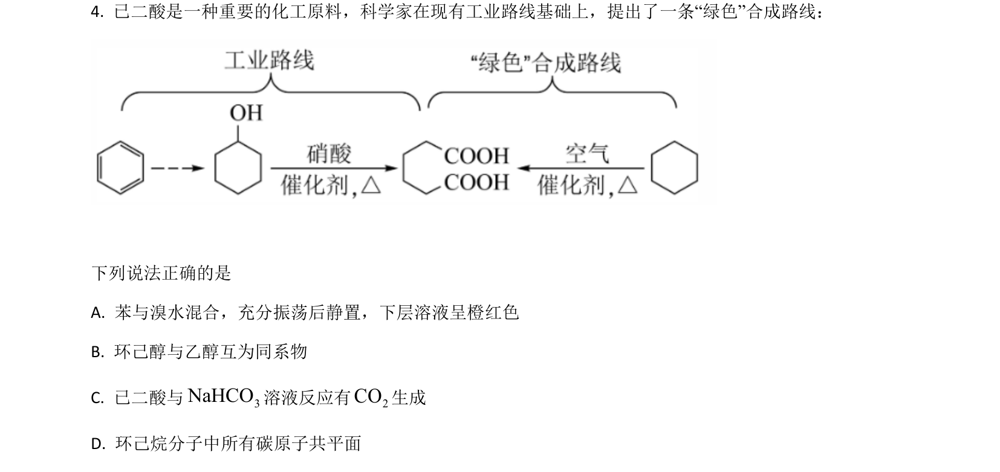
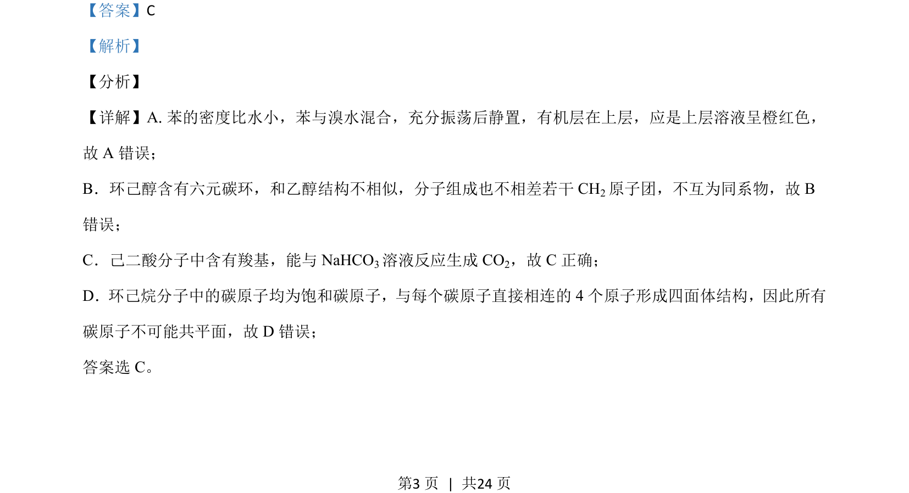

## 题面

## 摘要

（待补）

## 关联考点

## 答案与解析

> 📄 原 PDF 第 3 页：`素材/真题/湖南/2008-2024·（湖南）化学高考真题/2021年高考化学试卷（湖南）（解析卷）.pdf`

<!-- 题干文本-start -->
## 题干文本
4. 已二酸是一种重要的化工原料，科学家在现有工业路线基础上，提出了一条“绿色”合成路线：
下列说法正确的是
A. 苯与溴水混合，充分振荡后静置，下层溶液呈橙红色
B. 环己醇与乙醇互为同系物
C. 已二酸与 3NaHCO溶液反应有2CO生成
D. 环己烷分子中所有碳原子共平面
<!-- 题干文本-end -->

<!-- 解析文本-start -->
## 解析文本
【答案】C
【解析】
【分析】
【详解】A.苯的密度比水小，苯与溴水混合，充分振荡后静置，有机层在上层，应是上层溶液呈橙红色，
故 A 错误；
B．环己醇含有六元碳环，和乙醇结构不相似，分子组成也不相差若干 CH2原子团，不互为同系物，故 B
错误；
C．己二酸分子中含有羧基，能与 NaHCO3溶液反应生成 CO2，故 C正确；
D．环己烷分子中的碳原子均为饱和碳原子，与每个碳原子直接相连的4 个原子形成四面体结构，因此所有
碳原子不可能共平面，故 D 错误；
答案选 C。
<!-- 解析文本-end -->
