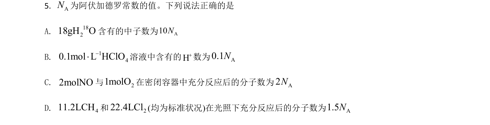
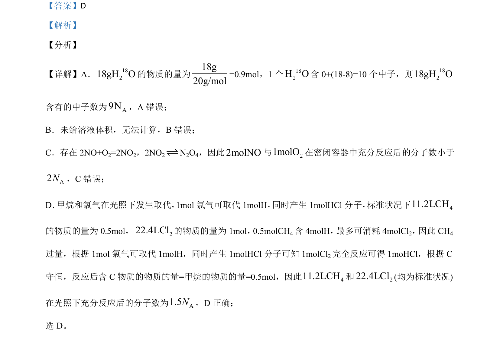

## 题面

## 摘要

考查物质的量相关计算与氯化镁工业流程分析。

## 关联考点

- [[450-阿伏伽德罗常数|阿伏加德罗常数]]
- [[289-可逆反应|可逆反应]]
- [[651-取代反应|取代反应]]
- [[氯化镁制备]]

## 答案与解析

> 📄 原 PDF 第 4 页：`素材/真题/湖南/2008-2024·（湖南）化学高考真题/2021年高考化学试卷（湖南）（解析卷）.pdf`
