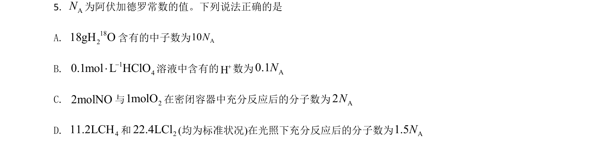
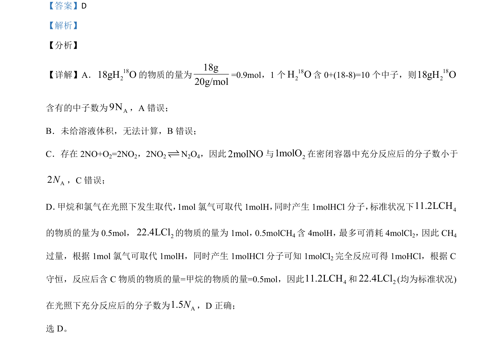

## 题面

## 摘要

考查物质的量相关计算与氯化镁工业流程分析。

## 关联考点

- [[450-阿伏伽德罗常数|阿伏加德罗常数]]
- [[289-可逆反应|可逆反应]]
- [[651-取代反应|取代反应]]
- [[氯化镁制备]]

## 答案与解析

> 📄 原 PDF 第 4 页：`素材/真题/湖南/2008-2024·（湖南）化学高考真题/2021年高考化学试卷（湖南）（解析卷）.pdf`

<!-- 题干文本-start -->
## 题干文本
5. AN为阿伏加德罗常数的值。下列说法正确的是
A. 18218gH O含有的中子数为A10N
B. 140.1mol L HClO-×溶液中含有的H+数为A0.1N
C. 2molNO与 21molO在密闭容器中充分反应后的分子数为A2N
D. 411.2LCH和 222.4LCl(均为标准状况)在光照下充分反应后的分子数为A1.5N
<!-- 题干文本-end -->

<!-- 解析文本-start -->
## 解析文本
【答案】D
【解析】
【分析】
【详解】A． 18218gH O的物质的量为
18g20g/mol=0.9mol，1 个182H O含 0+(18-8)=10 个中子，则 18218gH O
含有的中子数为A9N，A 错误；
B．未给溶液体积，无法计算，B错误；
C．存在 2NO+O2=2NO2，2NO2N2O4，因此2molNO与 21molO在密闭容器中充分反应后 分子数小于
A2N，C错误；
D． 甲烷和氯气在光照下发生取代，1mol氯气可取代 1molH， 同时产生1molHCl分子， 标准状况下 411.2LCH
的物质的量为 0.5mol， 222.4LCl的物质的量为 1mol，0.5molCH4含 4molH， 最多可消耗4molCl2， 因此CH4
过量，根据 1mol氯气可取代 1molH，同时产生 1molHCl分子可知 1molCl2完全反应可得 1moHCl，根据 C
守恒，反应后含 C物质的物质的量=甲烷的物质的量=0.5mol，因此 411.2LCH和 222.4LCl(均为标准状况)
在光照下充分反应后的分子数为A1.5N，D 正确；
选 D。
<!-- 解析文本-end -->
