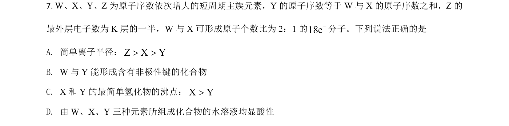
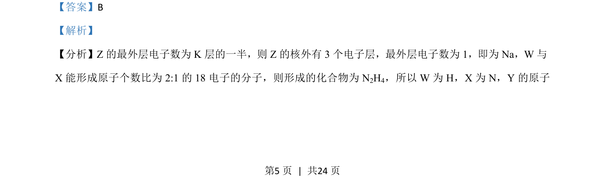
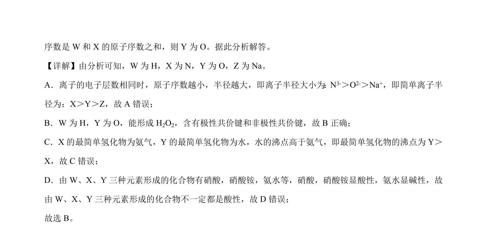

## 题面

## 摘要

推断短周期元素并辨析性质，考查氧化还原反应及物质检验

## 关联考点

- [[252-元素周期律|元素周期律]]
- [[258-化学键|化学键]]
- [[162-氧化还原反应|氧化还原反应]]
- [[557-物质检验|物质检验]]

## 答案与解析

> 📄 原 PDF 第 5 页：`素材/真题/湖南/2008-2024·（湖南）化学高考真题/2021年高考化学试卷（湖南）（解析卷）.pdf`
