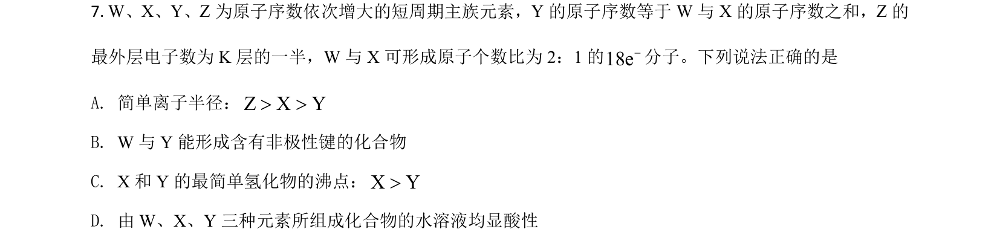
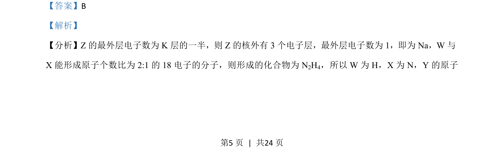
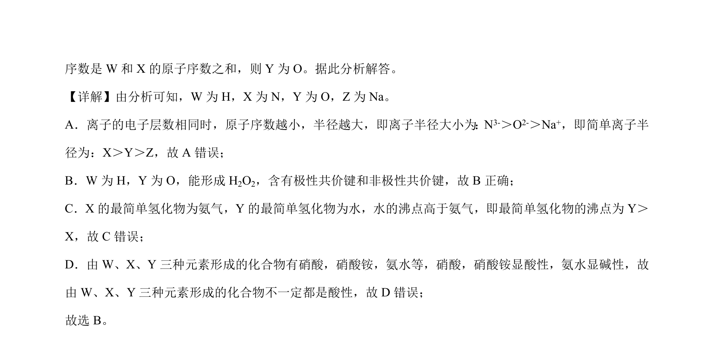

## 题面

## 摘要

推断短周期元素并辨析性质，考查氧化还原反应及物质检验

## 关联考点

- [[252-元素周期律|元素周期律]]
- [[258-化学键|化学键]]
- [[162-氧化还原反应|氧化还原反应]]
- [[557-物质检验|物质检验]]

## 答案与解析

> 📄 原 PDF 第 5 页：`素材/真题/湖南/2008-2024·（湖南）化学高考真题/2021年高考化学试卷（湖南）（解析卷）.pdf`

<!-- 题干文本-start -->
## 题干文本
7. W、X、Y、Z为原子序数依次增大的短周期主族元素，Y 的原子序数等于 W与 X 的原子序数之和，Z的
最外层电子数为 K 层的一半，W与 X 可形成原子个数比为 2：1 的18e-分子。下列说法正确的是
A. 简单离子半径：Z X Y> >
B. W与 Y 能形成含有非极性键的化合物
C. X 和 Y 的最简单氢化物的沸点：X Y>
D. 由 W、X、Y 三种元素所组成化合物的水溶液均显酸性
<!-- 题干文本-end -->

<!-- 解析文本-start -->
## 解析文本
【答案】B
【解析】
【分析】Z的最外层电子数为 K 层的一半，则 Z的核外有 3 个电子层，最外层电子数为 1，即为 Na，W与
X 能形成原子个数比为 2:1 的 18 电子的分子，则形成的化合物为 N2H4，所以 W 为 H，X 为 N，Y 的原子
<!-- 解析文本-end -->
