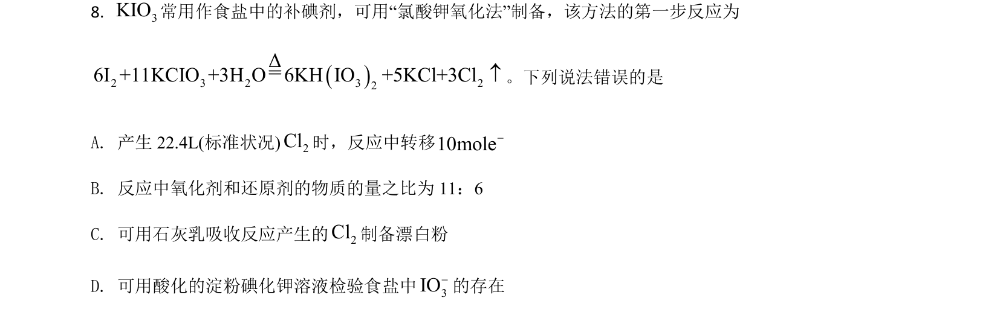
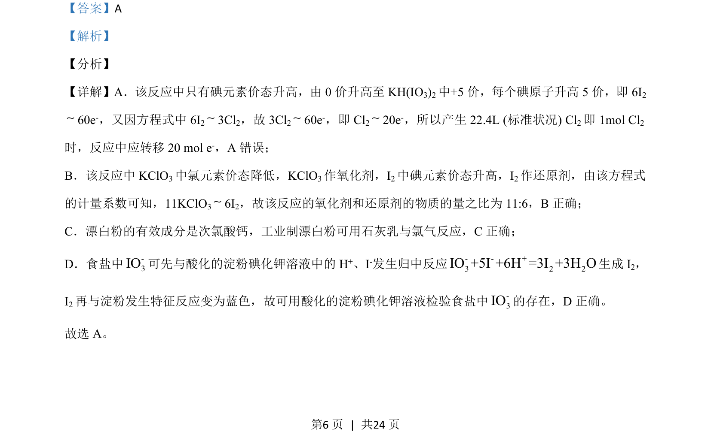

## 题面

## 摘要

考查氧化还原反应电子转移计算、物质性质及离子检验等知识，选项A转移电子数错误。

## 关联考点

- [[162-氧化还原反应|氧化还原反应]]
- [[165-电子转移|电子转移]]
- [[漂白粉有效成分]]
- [[碘酸根检验]]

## 答案与解析

> 📄 原 PDF 第 6 页：`素材/真题/湖南/2008-2024·（湖南）化学高考真题/2021年高考化学试卷（湖南）（解析卷）.pdf`
