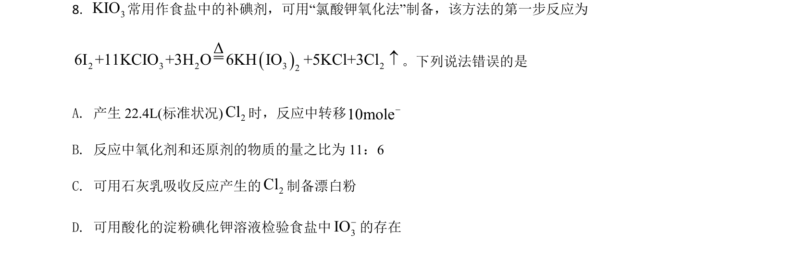
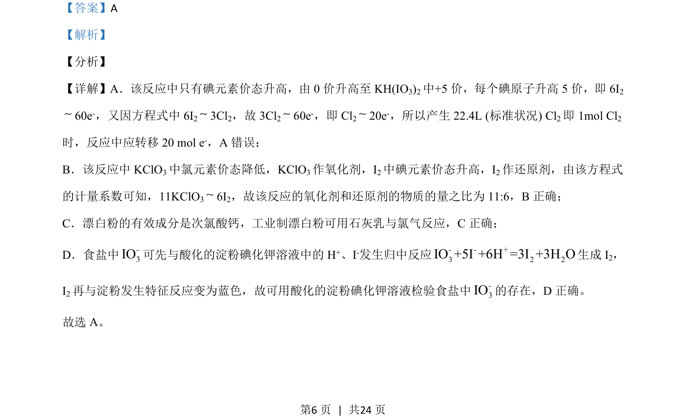

## 题面

## 摘要

考查氧化还原反应电子转移计算、物质性质及离子检验等知识，选项A转移电子数错误。

## 关联考点

- [[162-氧化还原反应|氧化还原反应]]
- [[165-电子转移|电子转移]]
- [[漂白粉有效成分]]
- [[碘酸根检验]]

## 答案与解析

> 📄 原 PDF 第 6 页：`素材/真题/湖南/2008-2024·（湖南）化学高考真题/2021年高考化学试卷（湖南）（解析卷）.pdf`

<!-- 题干文本-start -->
## 题干文本
8. 3KIO常用作食盐中的补碘剂，可用“氯酸钾氧化法”制备，该方法的第一步反应为
()2 3 2 3 22Δ6I +11KCIO +3H O 6KH IO +5KCl+3Cl­。下列说法错误的是
A. 产生 22.4L(标准状况)2Cl时，反应中转移10mole-
B. 反应中氧化剂和还原剂的物质的量之比为 11：6
C. 可用石灰乳吸收反应产生的2Cl制备漂白粉
D. 可用酸化的淀粉碘化钾溶液检验食盐中3IO-的存在
<!-- 题干文本-end -->

<!-- 解析文本-start -->
## 解析文本
【答案】A
【解析】
【分析】
【详解】A．该反应中只有碘元素价态升高，由 0 价升高至 KH(IO3)2中+5价，每个碘原子升高 5 价，即 6I2
:60e-，又因方程式中 6I2:3Cl2，故 3Cl2:60e-，即 Cl2:20e-，所以产生 22.4L (标准状况) Cl2即 1mol Cl2
时，反应中应转移 20 mol e-，A 错误；
B．该反应中 KClO3中氯元素价态降低，KClO3作氧化剂，I2中碘元素价态升高，I2作还原剂，由该方程式
的计量系数可知，11KClO3:6I2，故该反应的氧化剂和还原剂的物质的量之比为 11:6，B正确；
C．漂白粉的有效成分是次氯酸钙，工业制漂白粉可用石灰乳与氯气反应，C正确；
D．食盐中-3IO可先与酸化的淀粉碘化钾溶液中的 H+、I-发生归中反应- - +3 2 2IO +5I +6H =3I +3H O生成 I2，
I2再与淀粉发生特征反应变为蓝色，故可用酸化的淀粉碘化钾溶液检验食盐中-3IO的存在，D 正确。
故选 A。
<!-- 解析文本-end -->
