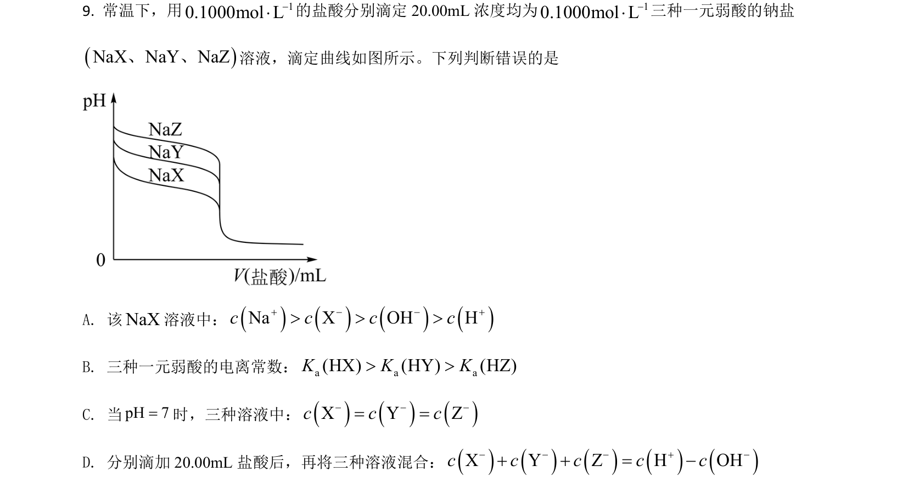
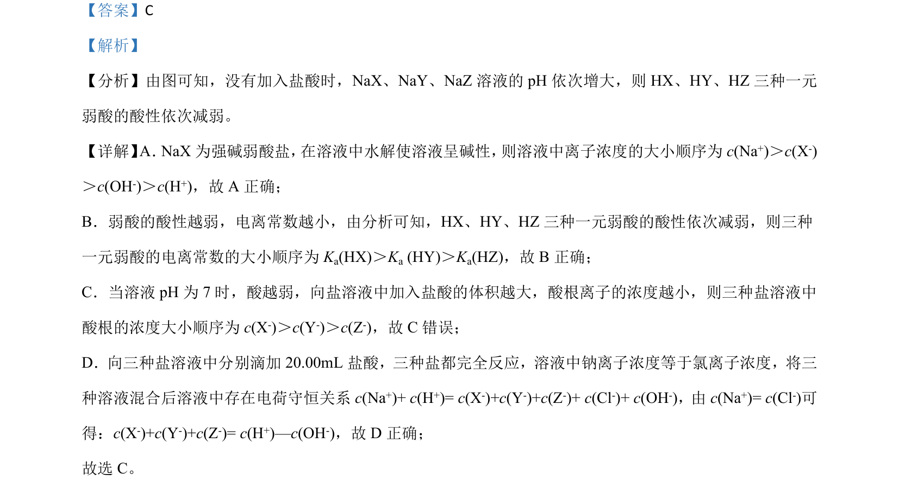

## 题面

## 摘要

该题考查弱酸盐溶液pH与酸性强弱关系，结合离子浓度比较、电离常数及电荷守恒判断正误。

## 关联考点

- [[336-盐类水解|盐类水解]]
- [[弱酸电离常数]]
- [[337-离子浓度比较|离子浓度比较]]
- [[689-电荷数守恒|电荷守恒]]

## 答案与解析

> 📄 原 PDF 第 7 页：`素材/真题/湖南/2008-2024·（湖南）化学高考真题/2021年高考化学试卷（湖南）（解析卷）.pdf`
