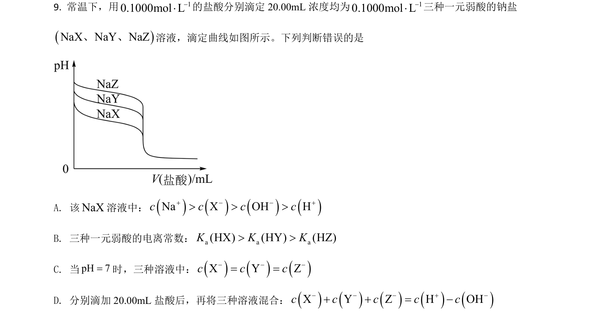
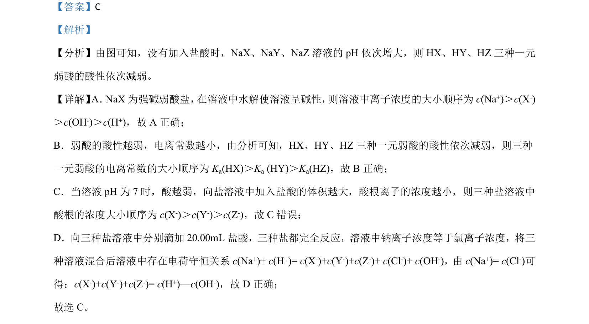

## 题面

## 摘要

该题考查弱酸盐溶液pH与酸性强弱关系，结合离子浓度比较、电离常数及电荷守恒判断正误。

## 关联考点

- [[336-盐类水解|盐类水解]]
- [[弱酸电离常数]]
- [[337-离子浓度比较|离子浓度比较]]
- [[689-电荷数守恒|电荷守恒]]

## 答案与解析

> 📄 原 PDF 第 7 页：`素材/真题/湖南/2008-2024·（湖南）化学高考真题/2021年高考化学试卷（湖南）（解析卷）.pdf`

<!-- 题干文本-start -->
## 题干文本
9. 常温下，用 10.1000mol L-×的盐酸分别滴定 20.00mL浓度均为 10.1000mol L-×三种一元弱酸的钠盐
NaX NaY NaZ、、溶液，滴定曲线如图所示。下列判断错误的是
A. 该NaX溶液中：Na X OH H+ - - +> > >c c c c
B. 三种一元弱酸的电离常数：a a a(HX) (HY) (HZ)> >K K K
C. 当pH 7=时，三种溶液中：X Y Z- - -= =c c c
D. 分别滴加 20.00mL盐酸后，再将三种溶液混合：X Y Z H OH- - - + -+ + = -c c c c c
<!-- 题干文本-end -->

<!-- 解析文本-start -->
## 解析文本
【答案】C
【解析】
【分析】由图可知，没有加入盐酸时，NaX、NaY、NaZ 溶液的 pH 依次增大，则 HX、HY、HZ 三种一元
弱酸的酸性依次减弱。
【详解】A．NaX 为强碱弱酸盐， 在溶液中水解使溶液呈碱性， 则溶液中离子浓度的大小顺序为c(Na+)＞c(X-)
＞c(OH-)＞c(H+)，故 A 正确；
B．弱酸的酸性越弱，电离常数越小，由分析可知，HX、HY、HZ 三种一元弱酸的酸性依次减弱，则三种
一元弱酸的电离常数的大小顺序为 Ka(HX)＞Ka (HY)＞Ka(HZ)，故 B正确；
C．当溶液 pH 为 7 时，酸越弱，向盐溶液中加入盐酸的体积越大，酸根离子的浓度越小，则三种盐溶液中
酸根的浓度大小顺序为 c(X-)＞c(Y-)＞c(Z-)，故 C错误；
D．向三种盐溶液中分别滴加 20.00mL盐酸，三种盐都完全反应，溶液中钠离子浓度等于氯离子浓度，将三
种溶液混合后溶液中存在电荷守恒关系 c(Na+)+ c(H+)= c(X-)+c(Y-)+c(Z-)+ c(Cl-)+ c(OH-)，由c(Na+)= c(Cl-)可
得：c(X-)+c(Y-)+c(Z-)= c(H+)—c(OH-)，故 D 正确；
故选 C。
<!-- 解析文本-end -->
