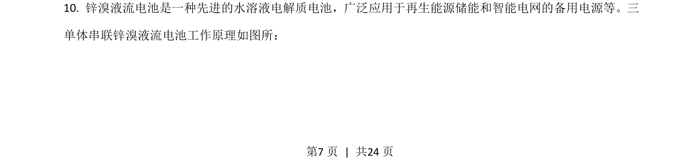
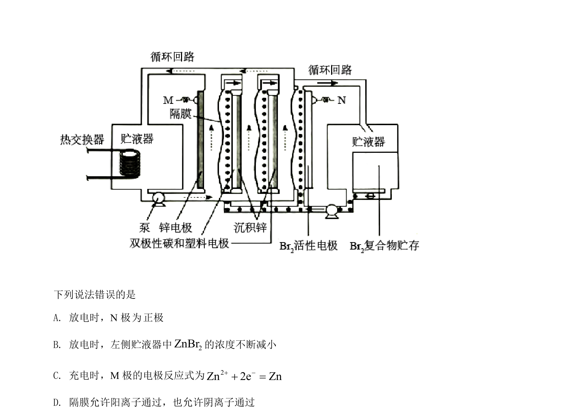
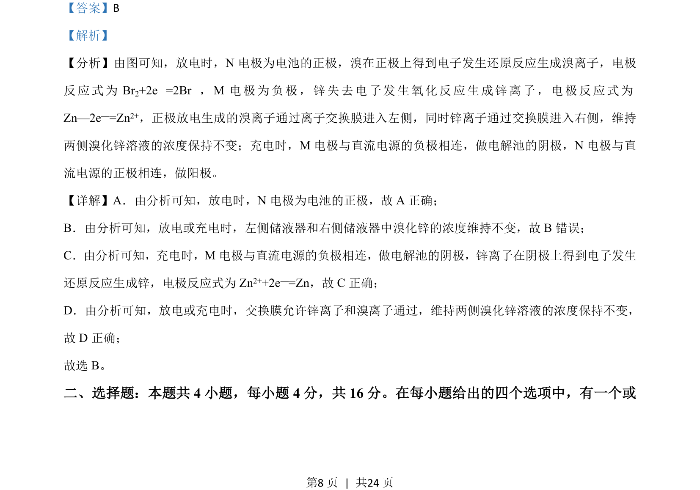

## 题面

## 摘要

该题考查锌-溴液流电池的充放电原理、电极判断、离子交换膜的作用及浓度变化。

## 关联考点

- [[原电池和电解池工作原理]]
- [[944-电极反应式的书写|电极反应式的书写]]
- [[离子交换膜的作用]]

## 答案与解析

> 📄 原 PDF 第 7 页：`素材/真题/湖南/2008-2024·（湖南）化学高考真题/2021年高考化学试卷（湖南）（解析卷）.pdf`

<!-- 题干文本-start -->
## 题干文本
10. 锌溴液流电池是一种先进的水溶液电解质电池，广泛应用于再生能源储能和智能电网的备用电源等。三
单体串联锌溴液流电池工作原理如图所：
<!-- 题干文本-end -->

<!-- 解析文本-start -->
## 解析文本

<!-- 解析文本-end -->
