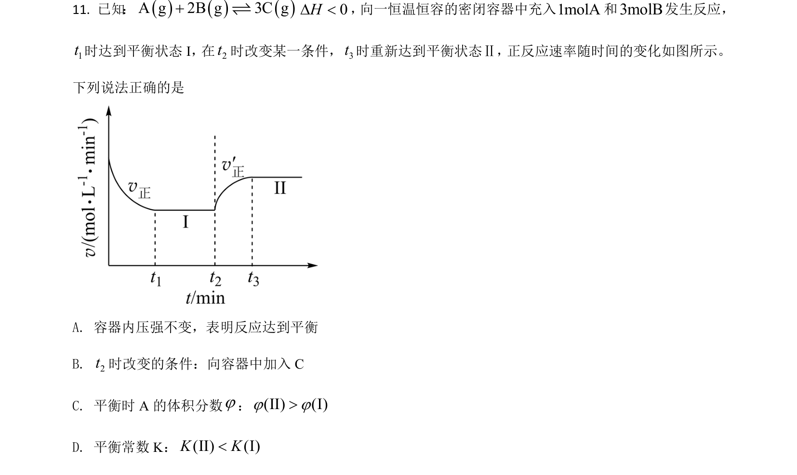
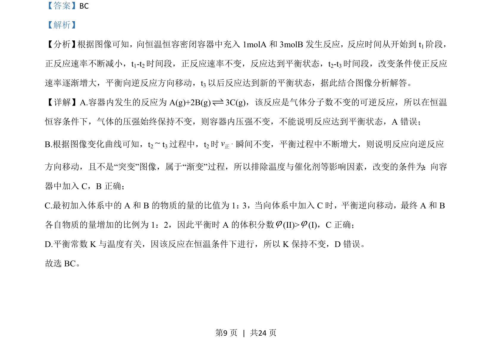

## 题面

## 摘要

考查恒温恒容下可逆反应速率变化图像及平衡移动判断。

## 关联考点

- [[283-化学反应速率|化学反应速率]]
- [[284-化学平衡|化学平衡]]
- [[349-平衡移动|平衡移动]]
- [[564-图像分析|图像分析]]

## 答案与解析

> 📄 原 PDF 第 9 页：`素材/真题/湖南/2008-2024·（湖南）化学高考真题/2021年高考化学试卷（湖南）（解析卷）.pdf`
