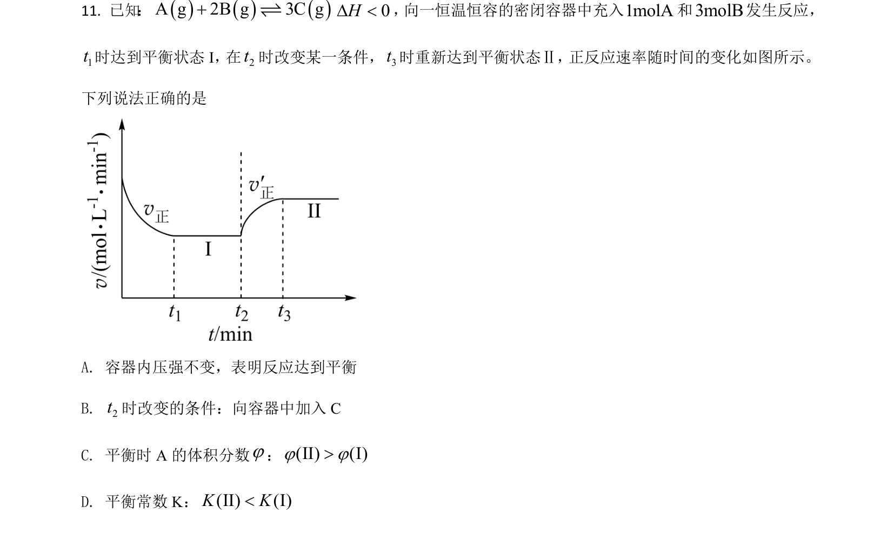
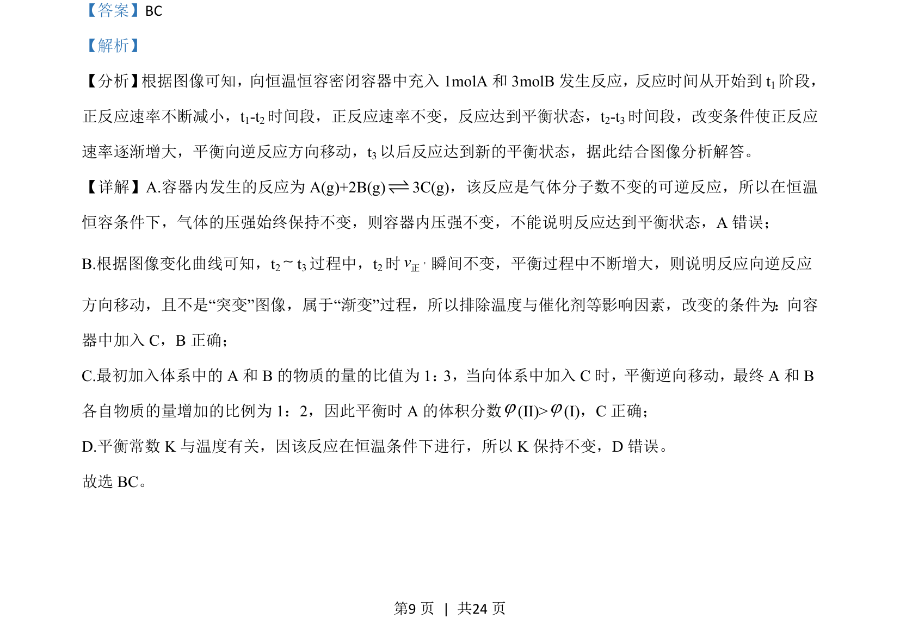

## 题面

## 摘要

考查恒温恒容下可逆反应速率变化图像及平衡移动判断。

## 关联考点

- [[283-化学反应速率|化学反应速率]]
- [[284-化学平衡|化学平衡]]
- [[349-平衡移动|平衡移动]]
- [[564-图像分析|图像分析]]

## 答案与解析

> 📄 原 PDF 第 9 页：`素材/真题/湖南/2008-2024·（湖南）化学高考真题/2021年高考化学试卷（湖南）（解析卷）.pdf`

<!-- 题干文本-start -->
## 题干文本
11. 已知 ：()()()A g 2B g 3C g+0HD <， 向一恒温恒容的密闭容器中充入1molA和3molB发生反应，
1t时达到平衡状态 I， 在2t时改变某一条件，3t时重新达到平衡状态Ⅱ， 正反应速率随时间的变化如图所示。
下列说法正确的是
A. 容器内压强不变，表明反应达到平衡
B. 2t时改变的条件：向容器中加入 C
C. 平衡时 A 的体积分数j：(II) (I)j j>
D. 平衡常数 K：(II) (I)<K K
<!-- 题干文本-end -->

<!-- 解析文本-start -->
## 解析文本
【答案】BC
【解析】
【分析】 根据图像可知，向恒温恒容密闭容器中充入1molA和 3molB发生反应，反应时间从开始到t1阶段，
正反应速率不断减小，t1-t2时间段，正反应速率不变，反应达到平衡状态，t2-t3时间段，改变条件使正反应
速率逐渐增大，平衡向逆反应方向移动，t3以后反应达到新的平衡状态，据此结合图像分析解答。
【详解】A.容器内发生的反应为 A(g)+2B(g)3C(g)，该反应是气体分子数不变的可逆反应，所以在恒温
恒容条件下，气体的压强始终保持不变，则容器内压强不变，不能说明反应达到平衡状态，A 错误；
B.根据图像变化曲线可知，t2:t3过程中，t2时v正
，瞬间不变，平衡过程中不断增大，则说明反应向逆反应
方向移动，且不是“突变”图像，属于“渐变”过程，所以排除温度与催化剂等影响因素，改变的条件为：向容
器中加入 C，B正确；
C.最初加入体系中的 A 和 B的物质的量的比值为 1：3，当向体系中加入C时，平衡逆向移动，最终A 和 B
各自物质的量增加的比例为 1：2，因此平衡时 A 的体积分数j(II)>j(I)，C正确；
D.平衡常数 K 与温度有关，因该反应在恒温条件下进行，所以 K 保持不变，D 错误。
故选 BC。
<!-- 解析文本-end -->
