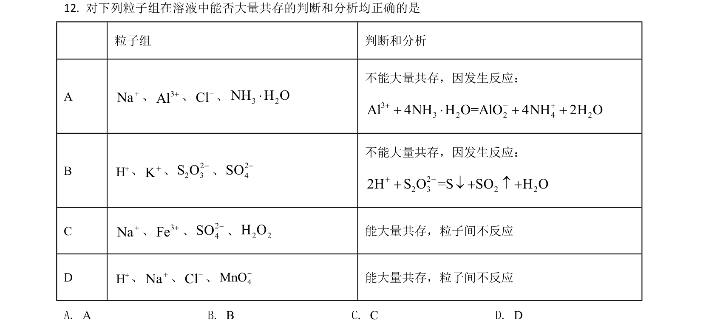
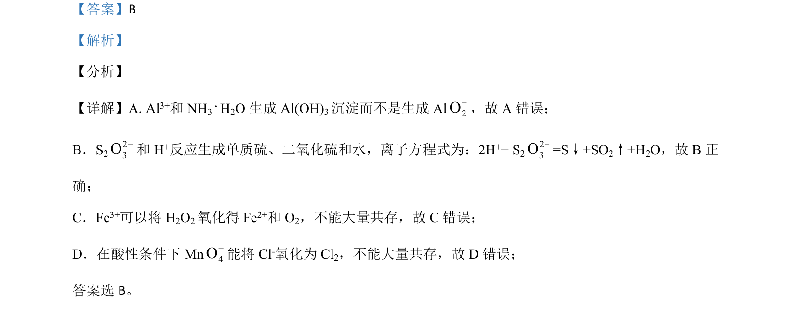

## 题面

## 摘要

考查离子方程式正误判断与1-溴丁烷制备实验装置及操作分析

## 关联考点

- [[907-离子方程式书写与正误判断|离子方程式正误判断]]
- [[162-氧化还原反应|氧化还原反应]]
- [[蒸馏与萃取分液]]
- [[002-化学实验基本操作|化学实验基本操作]]

## 答案与解析

> 📄 原 PDF 第 10 页：`素材/真题/湖南/2008-2024·（湖南）化学高考真题/2021年高考化学试卷（湖南）（解析卷）.pdf`
