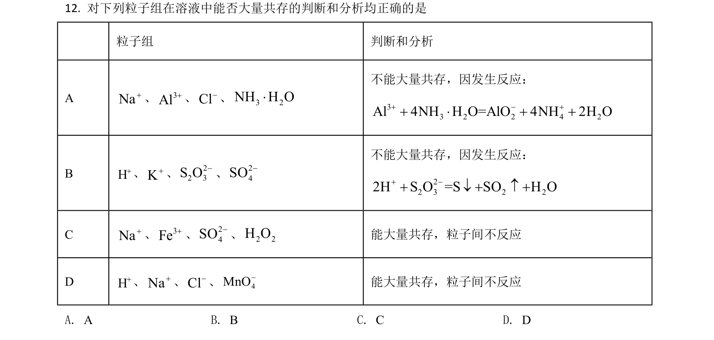
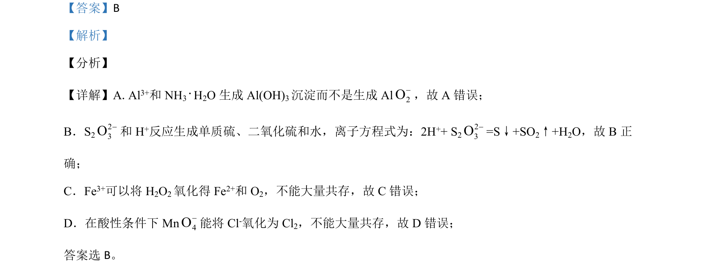

## 题面

## 摘要

考查离子方程式正误判断与1-溴丁烷制备实验装置及操作分析

## 关联考点

- [[907-离子方程式书写与正误判断|离子方程式正误判断]]
- [[162-氧化还原反应|氧化还原反应]]
- [[蒸馏与萃取分液]]
- [[002-化学实验基本操作|化学实验基本操作]]

## 答案与解析

> 📄 原 PDF 第 10 页：`素材/真题/湖南/2008-2024·（湖南）化学高考真题/2021年高考化学试卷（湖南）（解析卷）.pdf`

<!-- 题干文本-start -->
## 题干文本
12. 对下列粒子组在溶液中能否大量共存的判断和分析均正确的是
粒子组 判断和分析
ANa+、3Al+、Cl-、3 2NH H O×
不能大量共存，因发生反应：
33 2 2 4 2Al 4NH H O=AlO 4NH 2H O+ - ++ × + +
BH+、K+、22 3S O-、24SO-
不能大量共存，因发生反应：
22 3 2 22H S O S O=SO H+ -+ ¯ + ­ +
CNa+、3Fe+、24SO-、2 2H O能大量共存，粒子间不反应
DH+、Na+、Cl-、4MnO-能大量共存，粒子间不反应
A. A B. B C. C D. D
<!-- 题干文本-end -->

<!-- 解析文本-start -->
## 解析文本
【答案】B
【解析】
【分析】
【详解】A.Al3+和 NH3×H2O 生成 Al(OH)3沉淀而不是生成 Al2O-，故 A 错误；
B．S2
23O-和 H+反应生成单质硫、二氧化硫和水，离子方程式为：2H++ S2
23O-=S↓+SO2↑+H2O，故 B正
确；
C．Fe3+可以将 H2O2氧化得 Fe2+和 O2，不能大量共存，故 C错误；
D．在酸性条件下 Mn4O-能将 Cl-氧化为 Cl2，不能大量共存，故 D 错误；
答案选 B。
<!-- 解析文本-end -->
