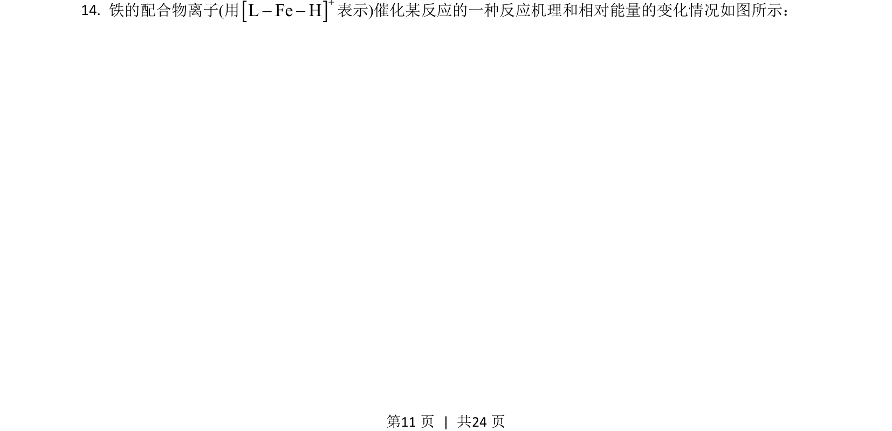
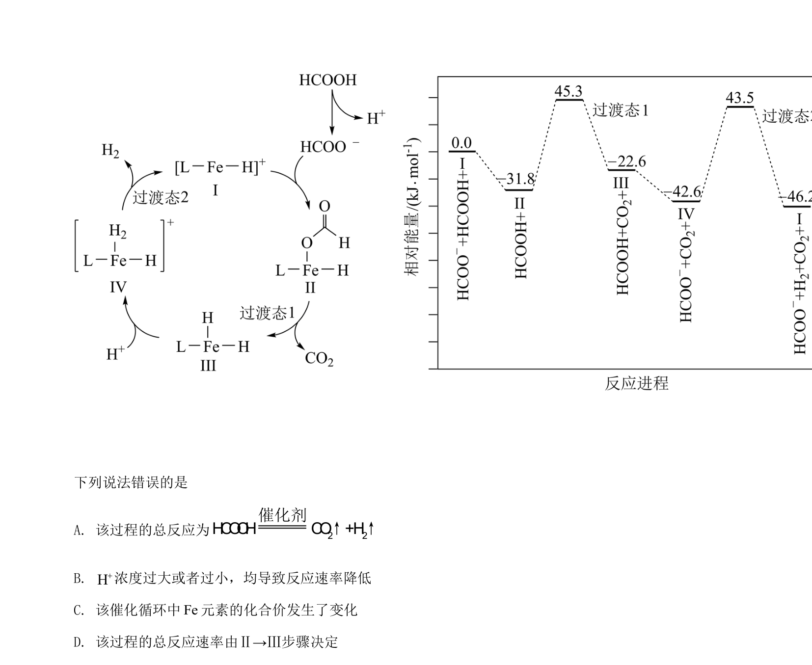
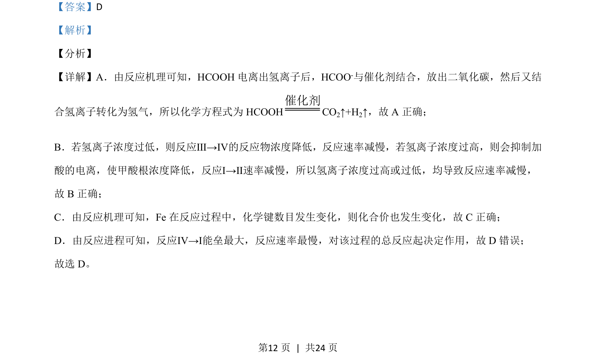
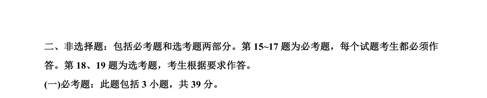

## 题面

## 摘要

考查甲酸分解反应机理，涉及催化剂、离子浓度对速率影响及决速步判断。

## 关联考点

- [[644-反应机理|反应机理]]
- [[039-催化剂|催化剂]]
- [[283-化学反应速率|反应速率]]
- [[351-活化能|活化能]]

## 答案与解析

> 📄 原 PDF 第 11 页：`素材/真题/湖南/2008-2024·（湖南）化学高考真题/2021年高考化学试卷（湖南）（解析卷）.pdf`
