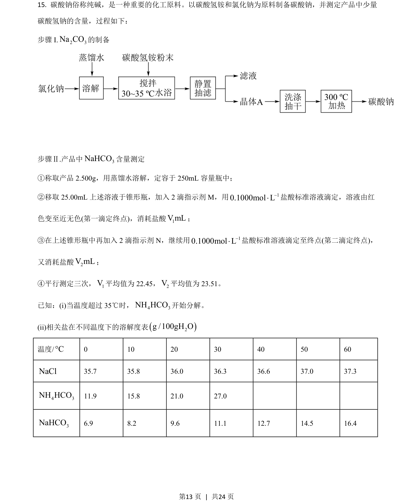
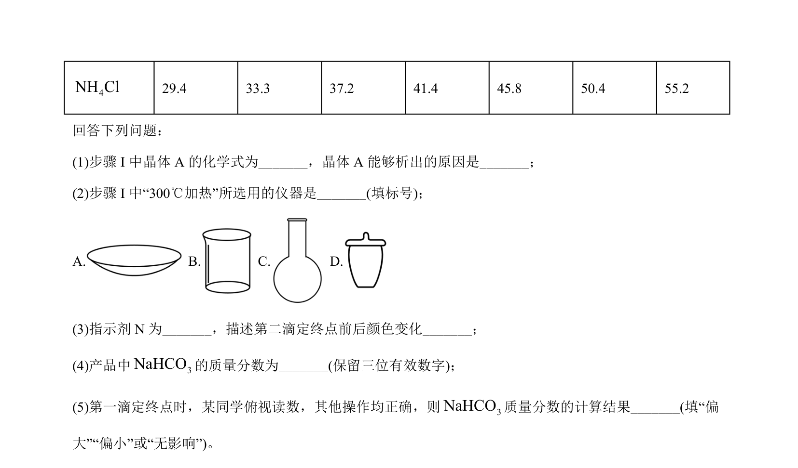
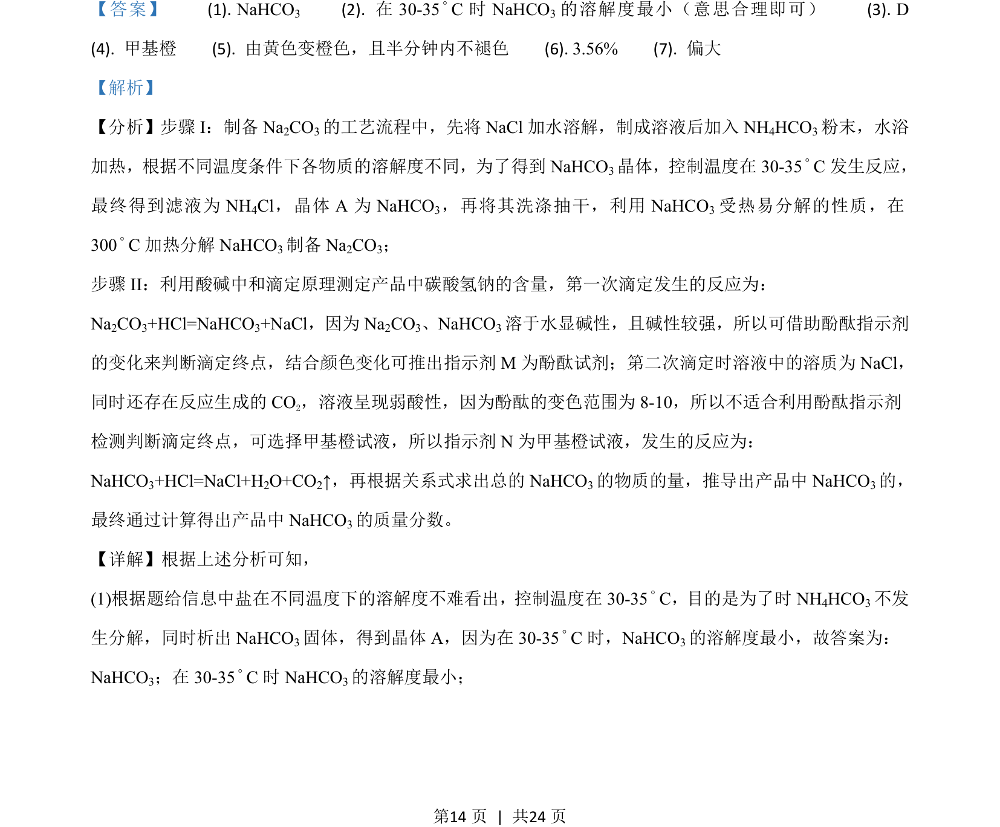
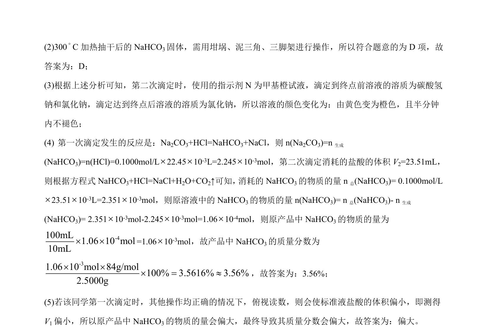

## 题面

## 摘要

该题考查了以 NaCl、NH₄HCO₃ 为原料制备 Na₂CO₃ 的工艺流程，以及利用双指示剂滴定法测定产品中 NaHCO₃ 含量。

## 关联考点

- [[制备纯碱]]
- [[碳酸氢钠分解]]
- [[双指示剂滴定]]
- [[323-指示剂选择|指示剂选择]]

## 答案与解析

> 📄 原 PDF 第 13 页：`素材/真题/湖南/2008-2024·（湖南）化学高考真题/2021年高考化学试卷（湖南）（解析卷）.pdf`
