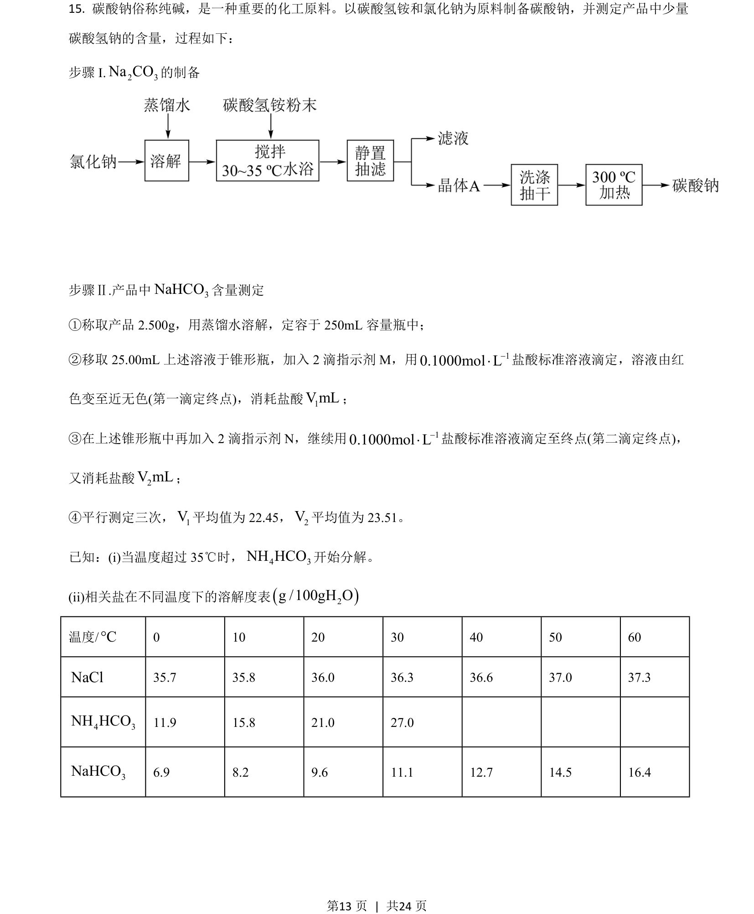
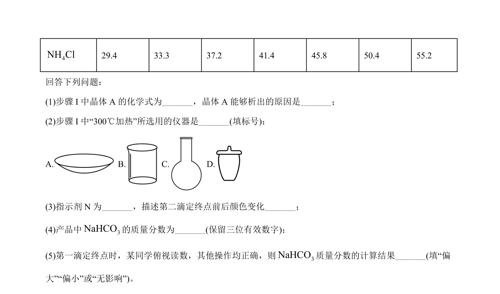
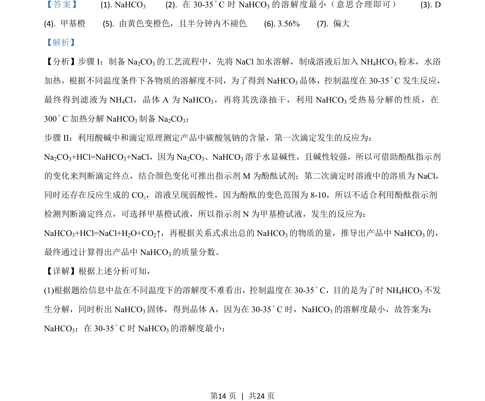
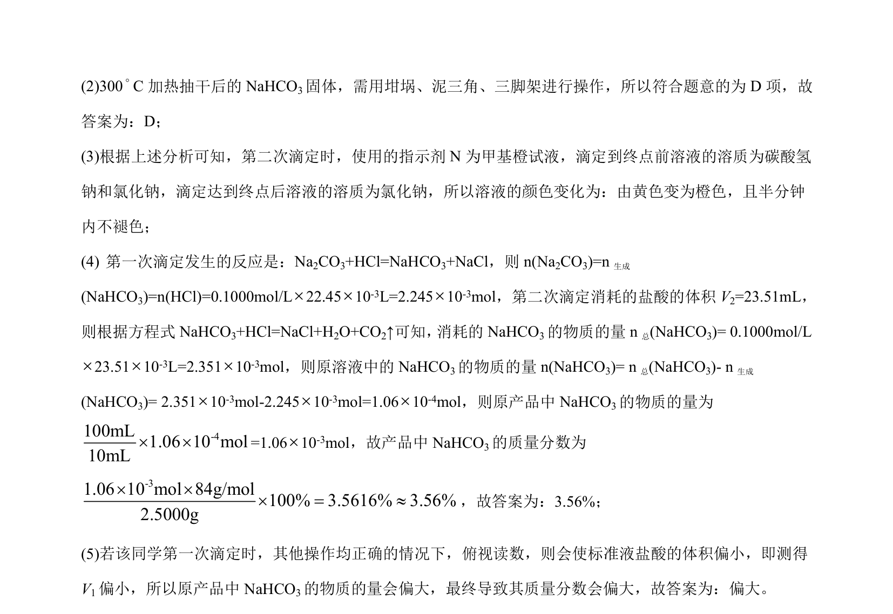

## 题面

## 摘要

该题考查了以 NaCl、NH₄HCO₃ 为原料制备 Na₂CO₃ 的工艺流程，以及利用双指示剂滴定法测定产品中 NaHCO₃ 含量。

## 关联考点

- [[制备纯碱]]
- [[碳酸氢钠分解]]
- [[双指示剂滴定]]
- [[323-指示剂选择|指示剂选择]]

## 答案与解析

> 📄 原 PDF 第 13 页：`素材/真题/湖南/2008-2024·（湖南）化学高考真题/2021年高考化学试卷（湖南）（解析卷）.pdf`

<!-- 题干文本-start -->
## 题干文本
15. 碳酸钠俗称纯碱，是一种重要的化工原料。以碳酸氢铵和氯化钠为原料制备碳酸钠，并测定产品中少量
碳酸氢钠的含量，过程如下：
步骤 I.2 3Na CO的制备
步骤Ⅱ.产品中 3NaHCO含量测定
①称取产品 2.500g，用蒸馏水溶解，定容于 250mL容量瓶中；
②移取 25.00mL上述溶液于锥形瓶，加入 2 滴指示剂 M，用 10.1000mol L-×盐酸标准溶液滴定，溶液由红
色变至近无色(第一滴定终点)，消耗盐酸1V mL；
③在上述锥形瓶中再加入 2 滴指示剂 N，继续用 10.1000mol L-×盐酸标准溶液滴定至终点(第二滴定终点)，
又消耗盐酸2V mL；
④平行测定三次，1V平均值为 22.45，2V平均值为 23.51。
已知：(i)当温度超过 35℃时，4 3NH HCO开始分解。
(ii)相关盐在不同温度下的溶解度表2g /100gH O
温度/C°0 10 20 30 40 50 60
NaCl35.7 35.8 36.0 36.3 36.6 37.0 37.3
4 3NH HCO11.9 15.8 21.0 27.0
3NaHCO6.9 8.2 9.6 11.1 12.7 14.5 16.4
<!-- 题干文本-end -->

<!-- 解析文本-start -->
## 解析文本

<!-- 解析文本-end -->
