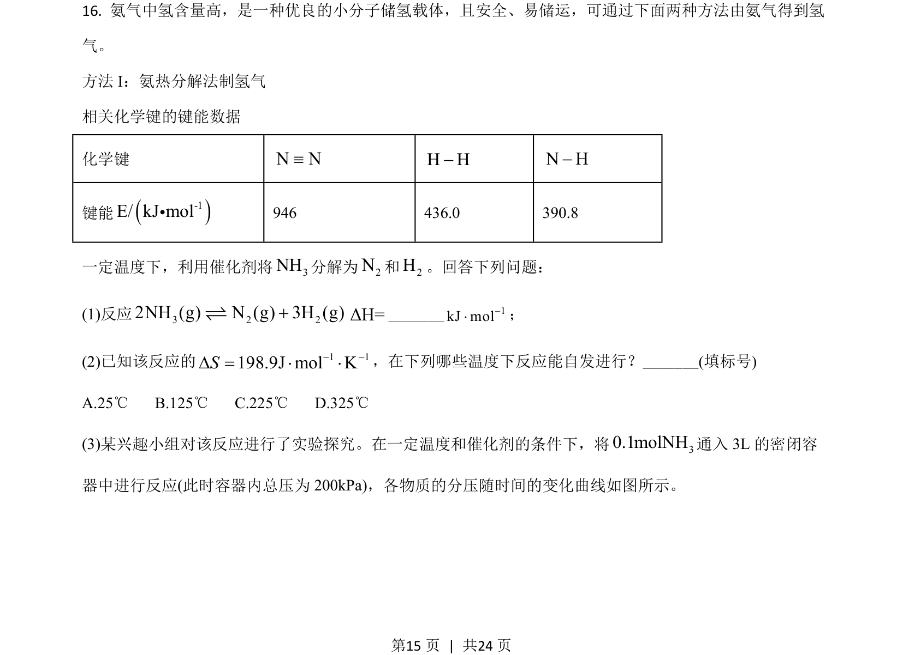
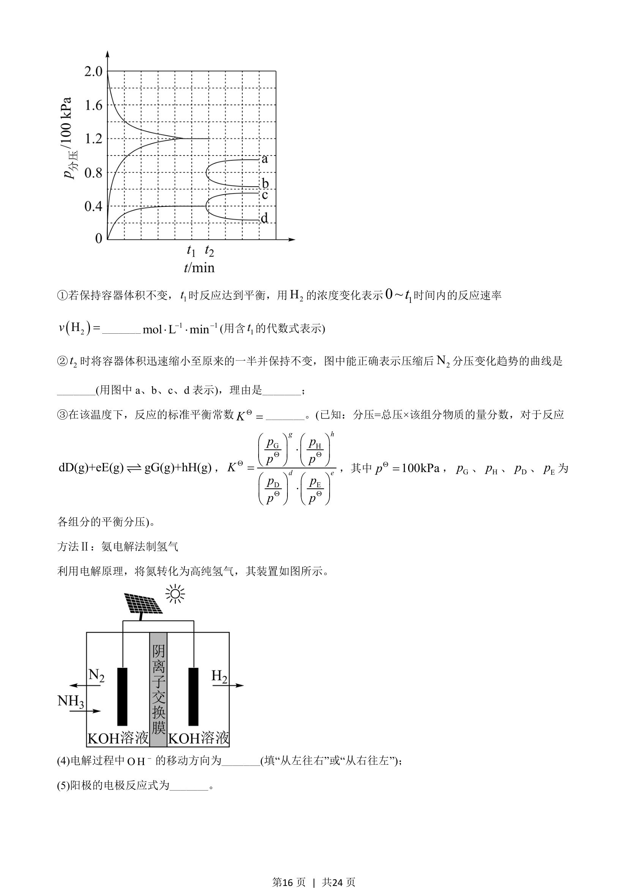
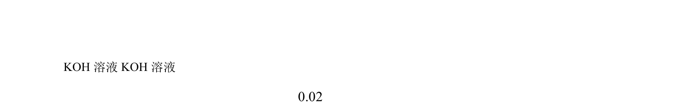
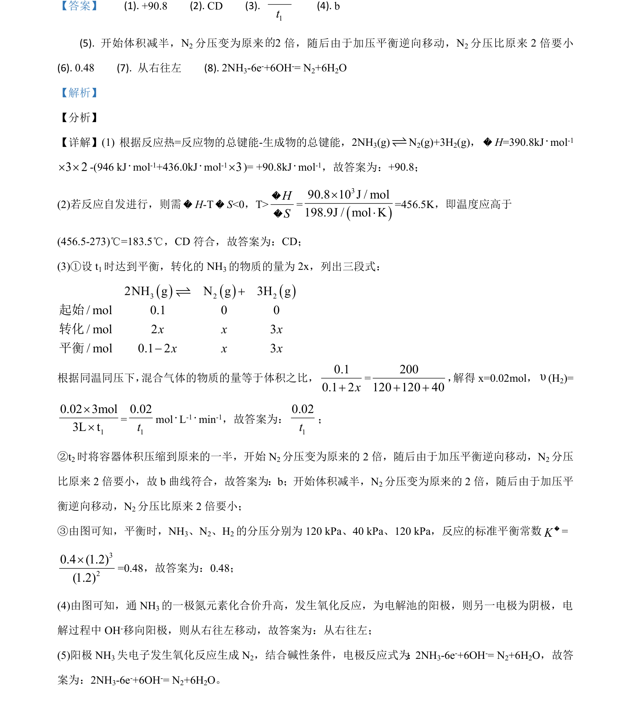

## 题面

## 摘要

考查反应热、反应自发性和化学平衡三段式计算

## 关联考点

- [[768-热化学方程式与反应热计算|反应热计算]]
- [[吉布斯自由能判据]]
- [[284-化学平衡|化学平衡]]
- [[三段式]]

## 答案与解析

> 📄 原 PDF 第 15 页：`素材/真题/湖南/2008-2024·（湖南）化学高考真题/2021年高考化学试卷（湖南）（解析卷）.pdf`
