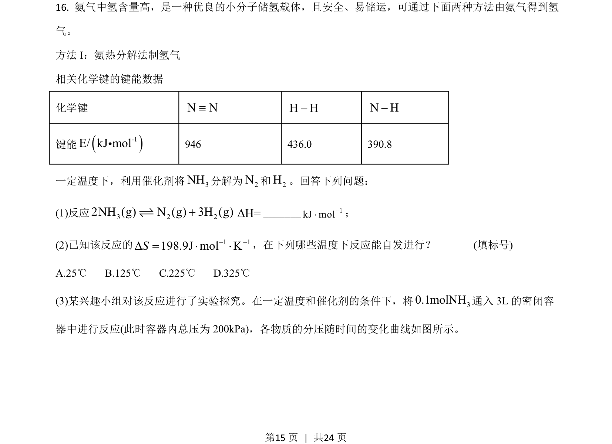
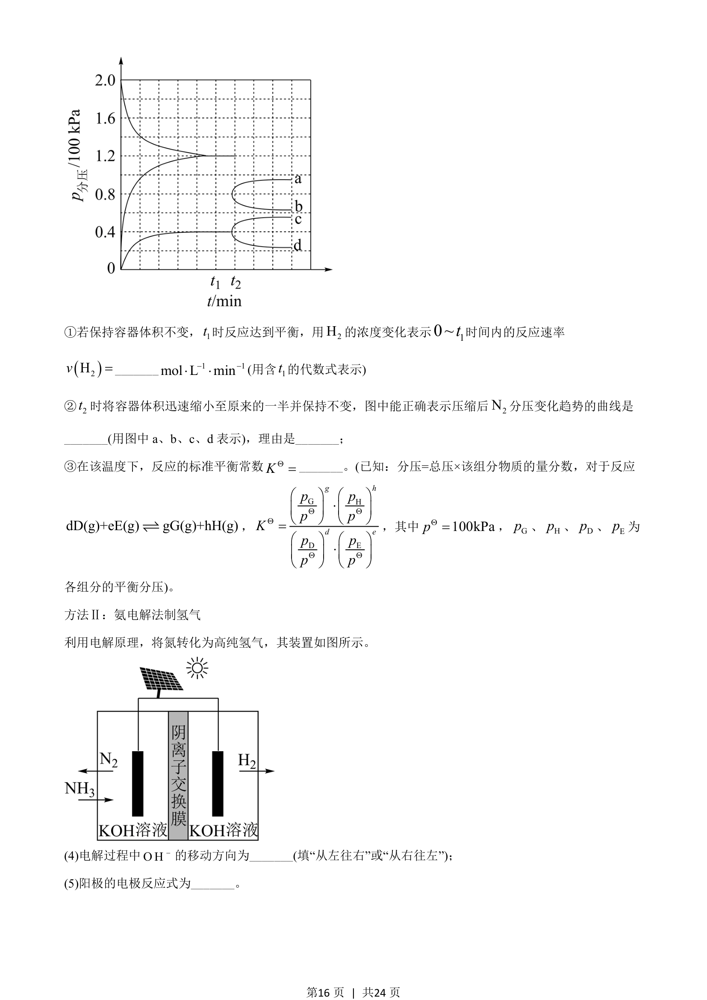
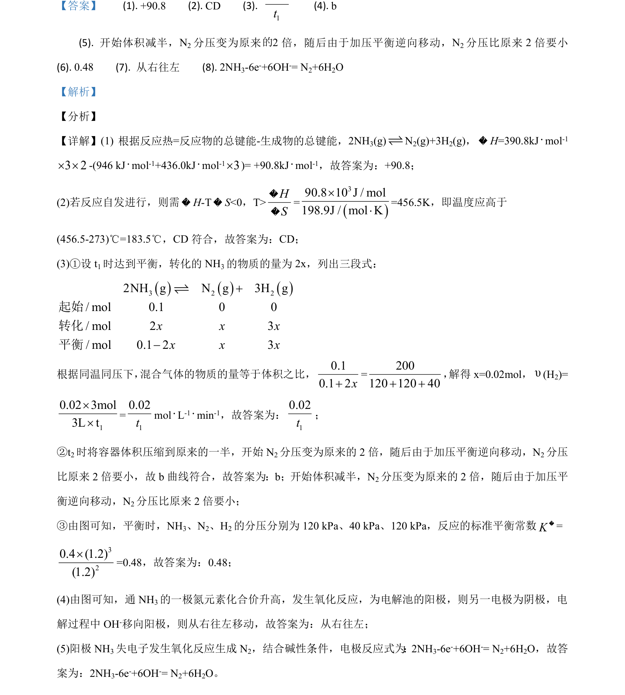

## 题面

## 摘要

考查反应热、反应自发性和化学平衡三段式计算

## 关联考点

- [[768-热化学方程式与反应热计算|反应热计算]]
- [[吉布斯自由能判据]]
- [[284-化学平衡|化学平衡]]
- [[三段式]]

## 答案与解析

> 📄 原 PDF 第 15 页：`素材/真题/湖南/2008-2024·（湖南）化学高考真题/2021年高考化学试卷（湖南）（解析卷）.pdf`

<!-- 题干文本-start -->
## 题干文本
16. 氨气中氢含量高，是一种优良的小分子储氢载体，且安全、易储运，可通过下面两种方法由氨气得到氢
气。
方法 I：氨热分解法制氢气
相关化学键的键能数据
化学键 N NºH H-N H-
键能()-1E/ kJ molg946 436.0 390.8
一定温度下，利用催化剂将3NH分解为2N和2H。回答下列问题：
(1)反应3 2 22NH (g) N (g) 3H (g)+ΔH=_______ 1kJ mol-×；
(2)已知该反应的 1 1198.9J mol K- -D = × ×S，在下列哪些温度下反应能自发进行？_______(填标号)
A.25℃    B.125 ℃    C.225 ℃    D.325 ℃
(3)某兴趣小组对该反应进行了实验探究。在一定温度和催化剂的条件下，将 30.1molNH通入 3L的密闭容
器中进行反应(此时容器内总压为 200kPa)，各物质的分压随时间的变化曲线如图所示。
<!-- 题干文本-end -->

<!-- 解析文本-start -->
## 解析文本

<!-- 解析文本-end -->
