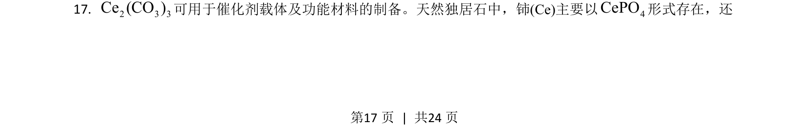
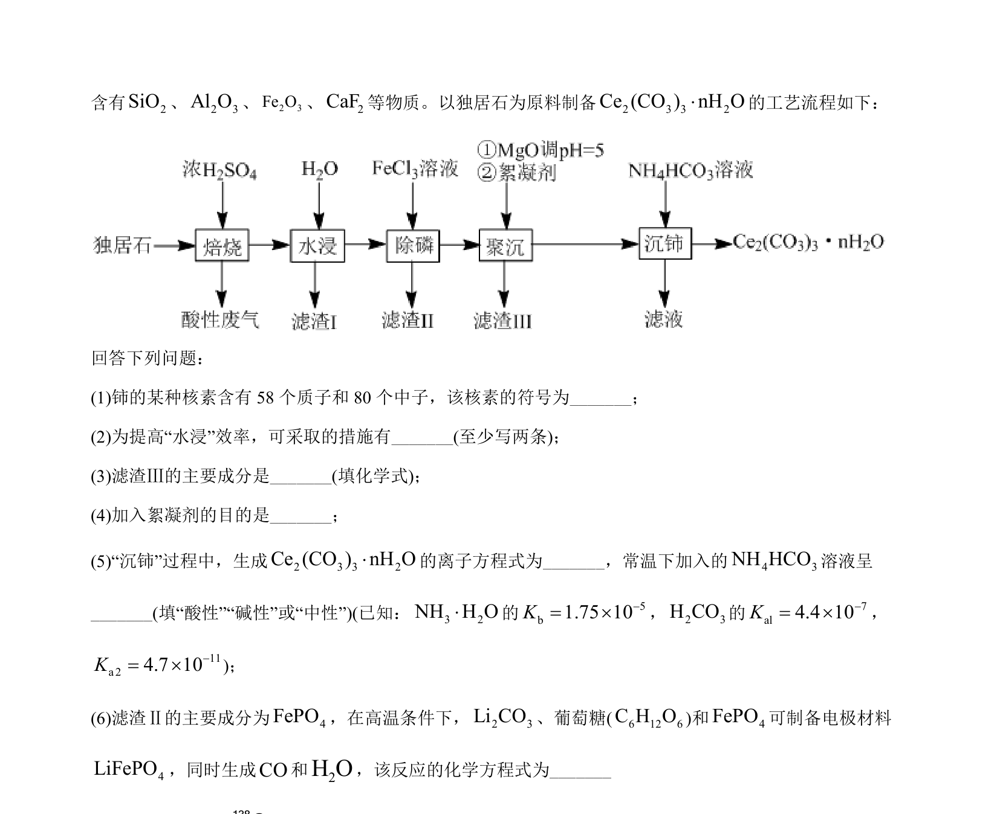
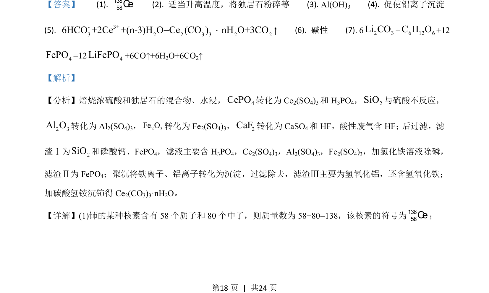
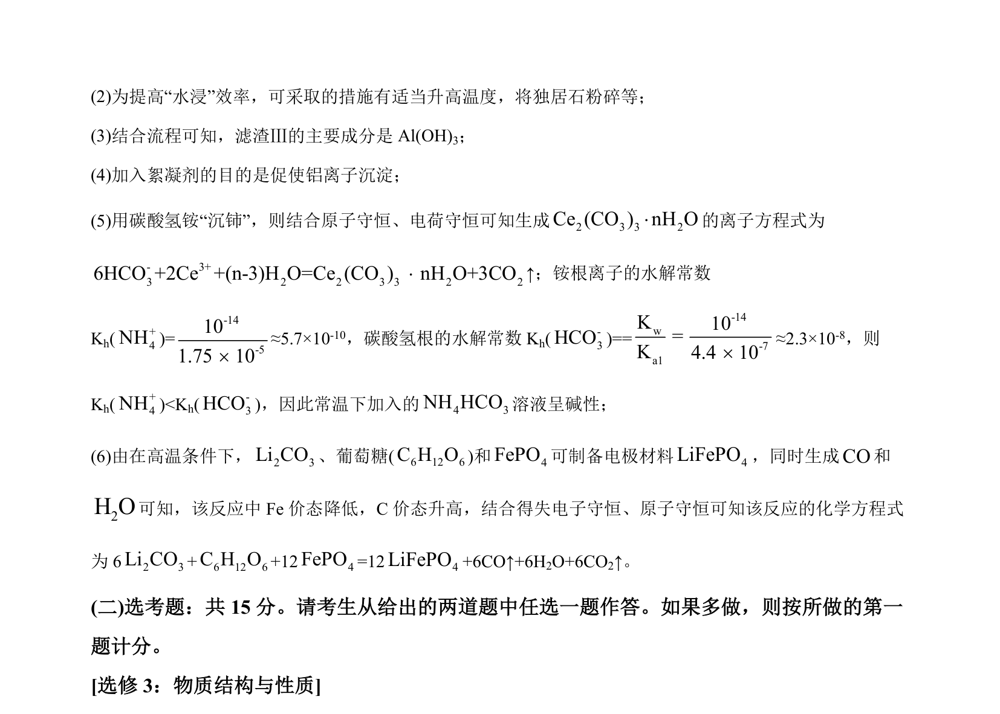

## 题面

## 摘要

考查独居石处理工艺流程，涉及核素符号、操作条件、产物判断、离子方程式及水解常数。

## 关联考点

- [[核素符号]]
- [[680-工艺流程分析|工艺流程分析]]
- [[806-离子方程式书写|离子方程式书写]]
- [[水解常数]]

## 答案与解析

> 📄 原 PDF 第 17 页：`素材/真题/湖南/2008-2024·（湖南）化学高考真题/2021年高考化学试卷（湖南）（解析卷）.pdf`
