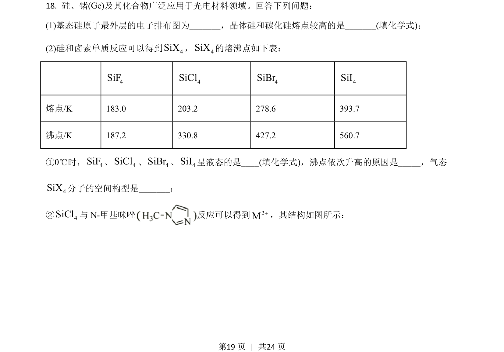
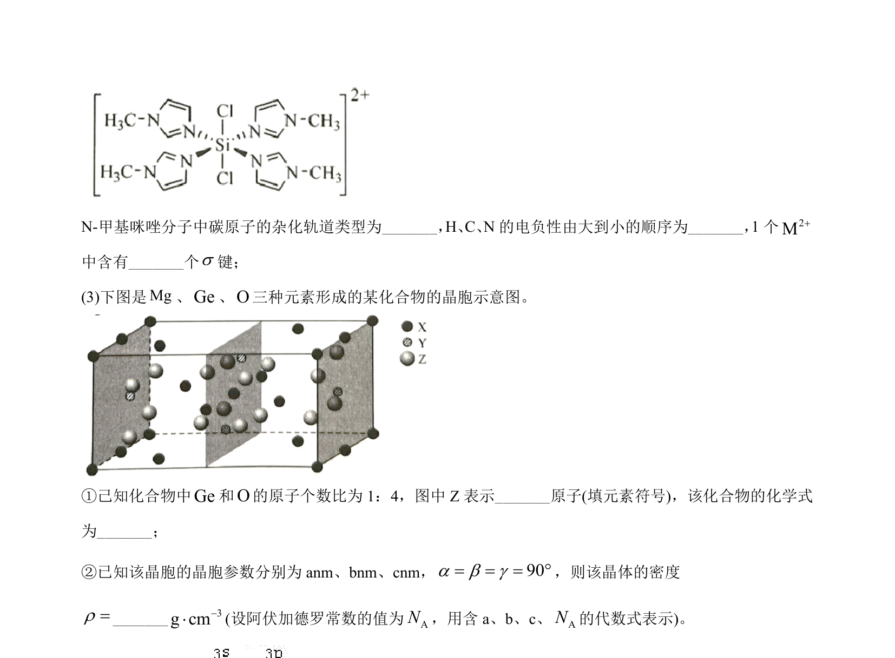
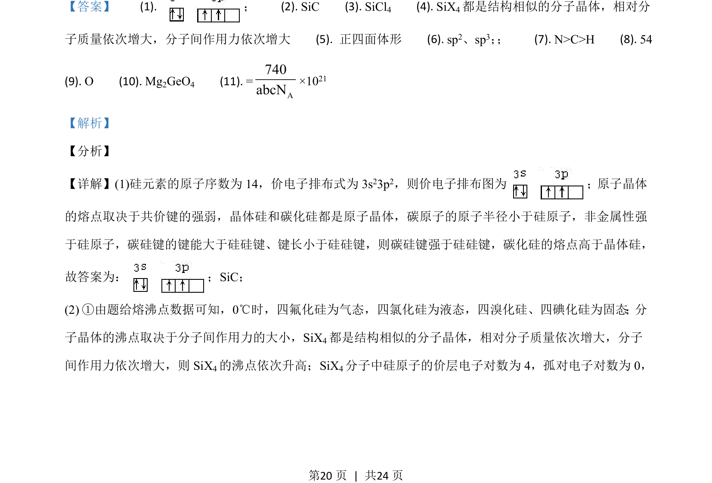
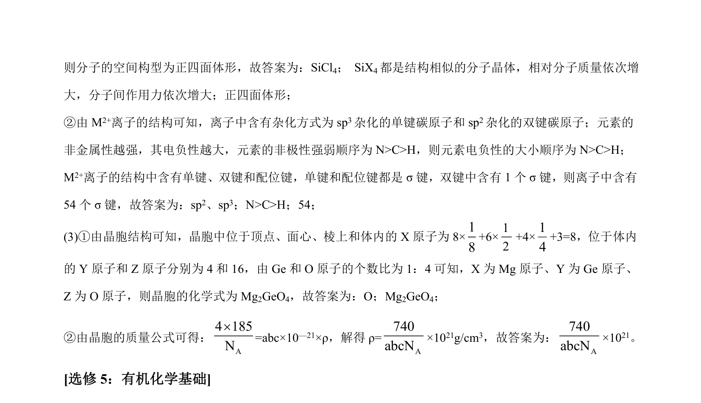

## 题面

## 摘要

本题综合考查物质结构与性质，涉及原子晶体熔点比较、分子晶体沸点规律、杂化方式、电负性、σ键计数及晶胞计算。

## 关联考点

- [[原子晶体熔点比较]]
- [[分子晶体沸点比较]]
- [[719-杂化方式|杂化方式]]
- [[391-电负性|电负性]]
- [[424-σ键|σ键]]
- [[晶胞化学式与密度计算]]

## 答案与解析

> 📄 原 PDF 第 19 页：`素材/真题/湖南/2008-2024·（湖南）化学高考真题/2021年高考化学试卷（湖南）（解析卷）.pdf`
