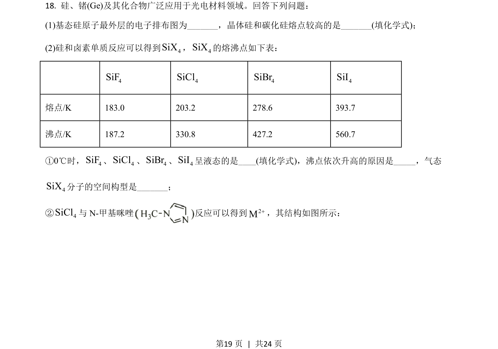
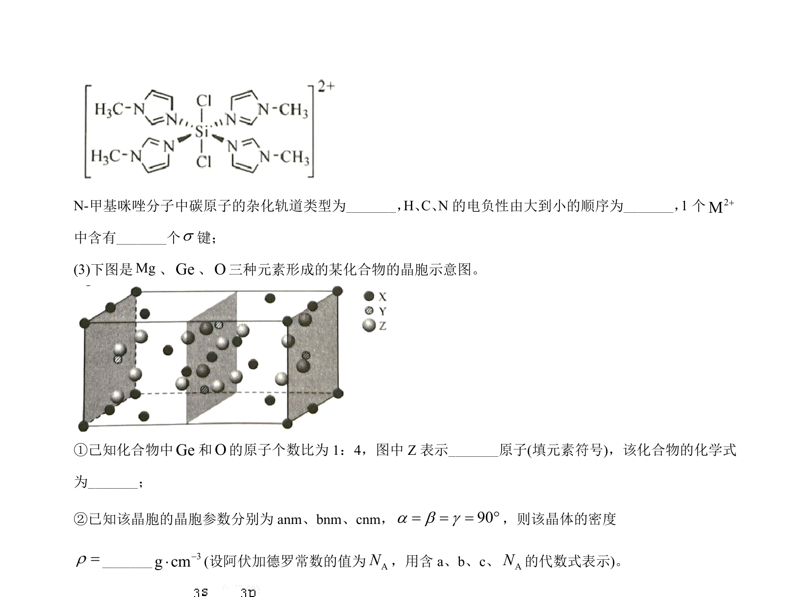
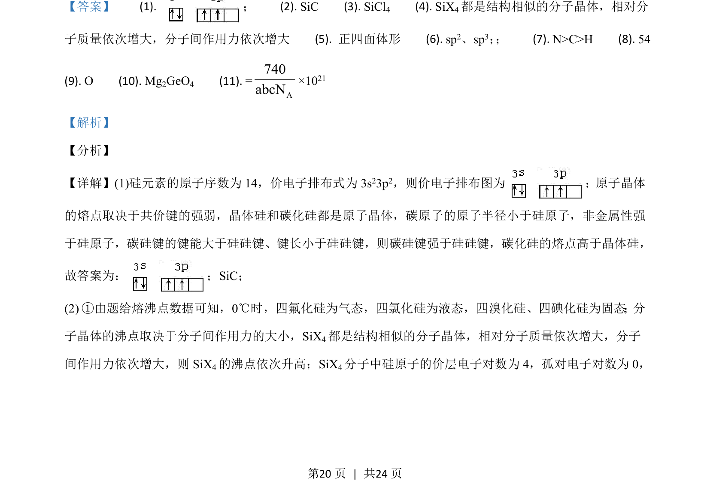
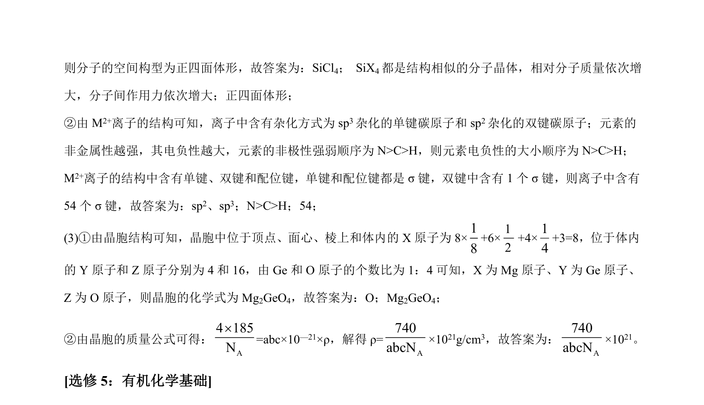

## 题面

## 摘要

本题综合考查物质结构与性质，涉及原子晶体熔点比较、分子晶体沸点规律、杂化方式、电负性、σ键计数及晶胞计算。

## 关联考点

- [[原子晶体熔点比较]]
- [[分子晶体沸点比较]]
- [[719-杂化方式|杂化方式]]
- [[391-电负性|电负性]]
- [[424-σ键|σ键]]
- [[晶胞化学式与密度计算]]

## 答案与解析

> 📄 原 PDF 第 19 页：`素材/真题/湖南/2008-2024·（湖南）化学高考真题/2021年高考化学试卷（湖南）（解析卷）.pdf`

<!-- 题干文本-start -->
## 题干文本
18. 硅、锗(Ge)及其化合物广泛应用于光电材料领域。回答下列问题：
(1)基态硅原子最外层的电子排布图为_______，晶体硅和碳化硅熔点较高的是_______(填化学式)；
(2)硅和卤素单质反应可以得到4SiX，4SiX的熔沸点如下表：
4SiF4SiCl4SiBr4SiI
熔点/K 183.0 203.2 278.6 393.7
沸点/K 187.2 330.8 427.2 560.7
①0℃时，4SiF、4SiCl、4SiBr、4SiI呈液态的是____(填化学式)，沸点依次升高的原因是_____，气态
4SiX分子的空间构型是_______；
②4SiCl与 N-甲基咪唑 反应可以得到 2M+，其结构如图所示：
<!-- 题干文本-end -->

<!-- 解析文本-start -->
## 解析文本

<!-- 解析文本-end -->
