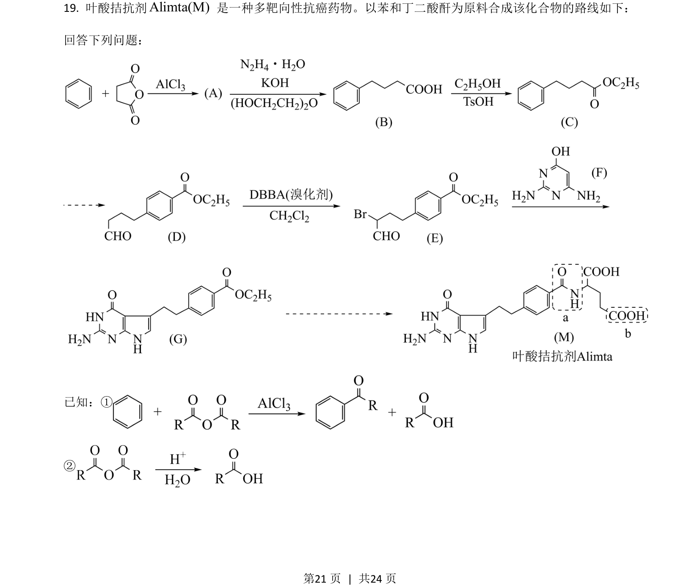
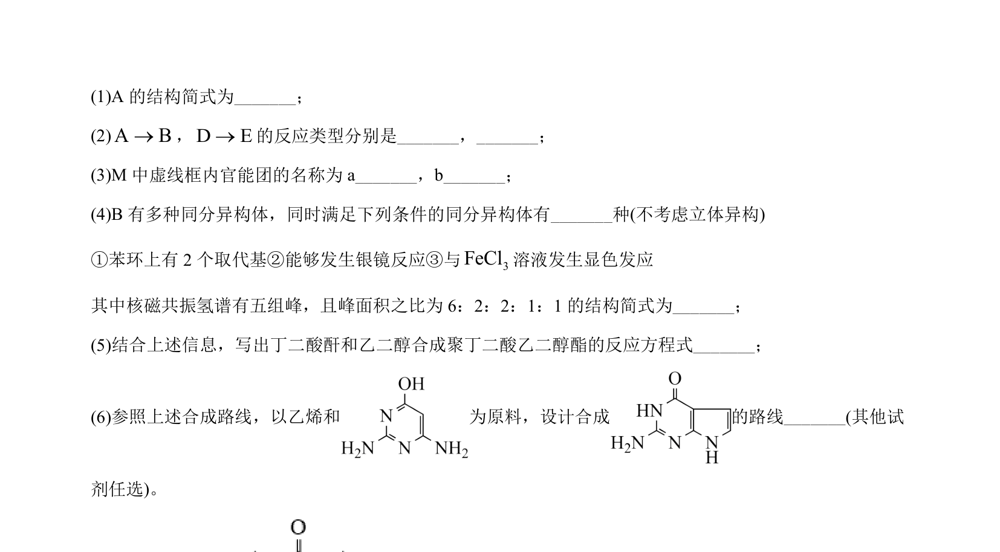
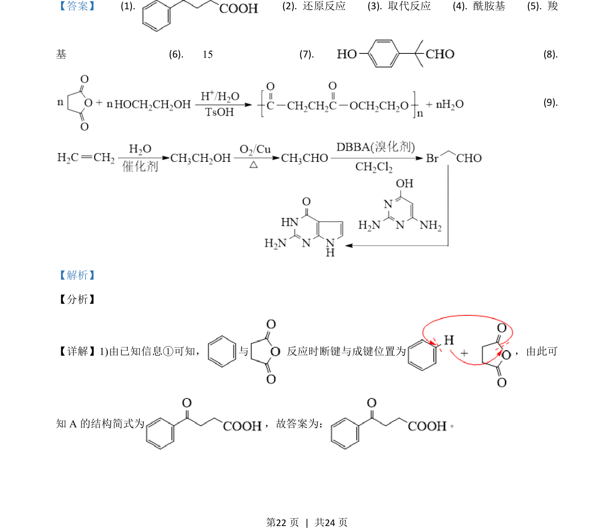
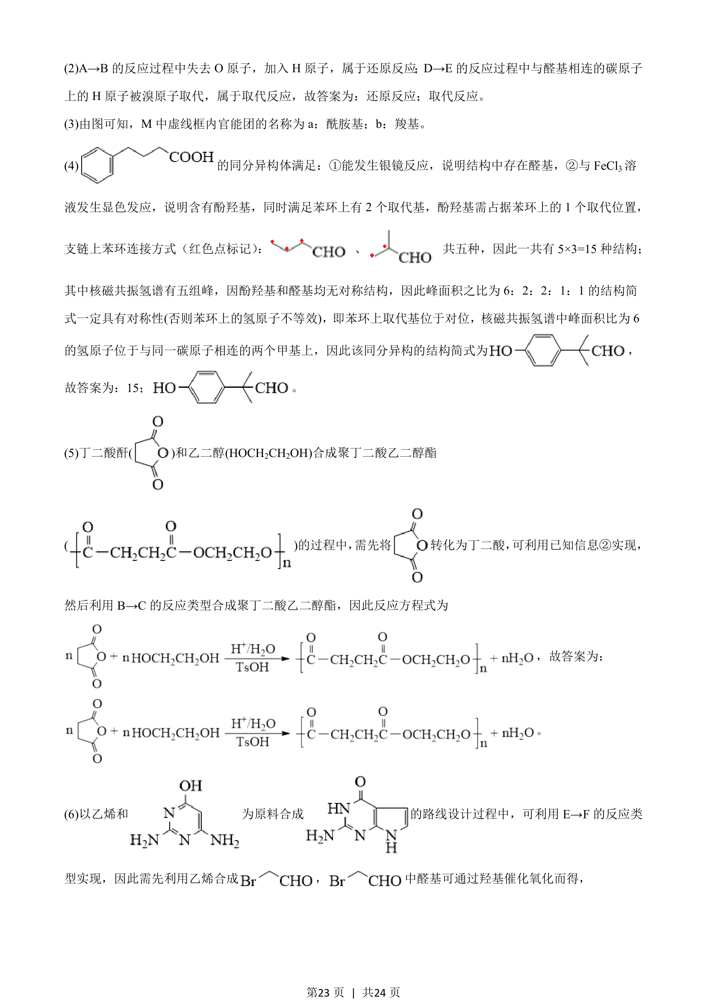
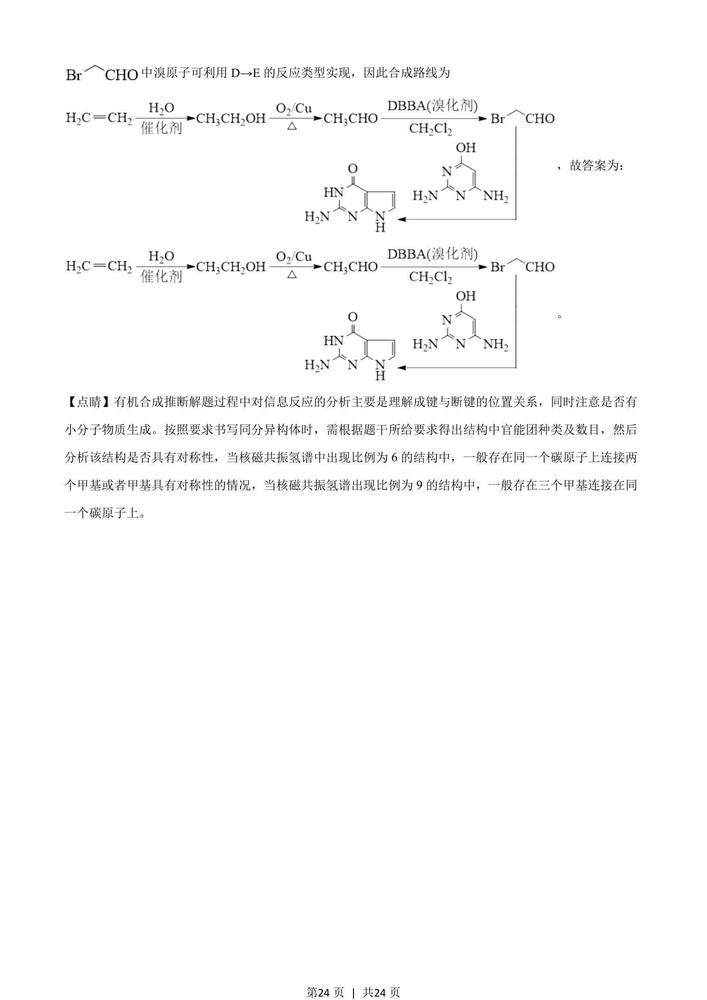

## 题面

## 摘要

该题考查有机合成推断，包括反应类型判断、官能团识别、同分异构体书写及合成路线设计。

## 关联考点

- [[酰胺基]]
- [[822-羧基|羧基]]
- [[醛基]]
- [[848-酚羟基|酚羟基]]

## 答案与解析

> 📄 原 PDF 第 21 页：`素材/真题/湖南/2008-2024·（湖南）化学高考真题/2021年高考化学试卷（湖南）（解析卷）.pdf`
