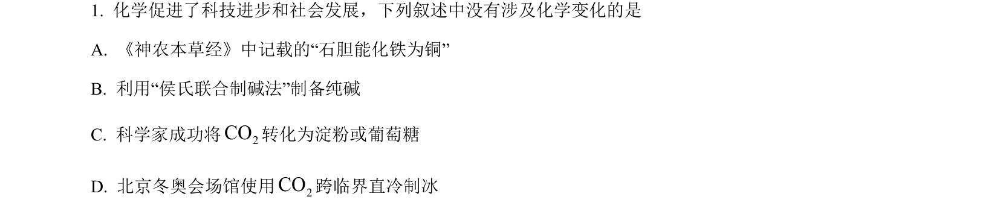
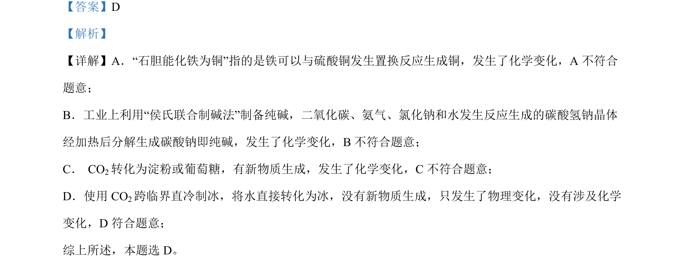

## 题面

## 摘要

该题考查物理变化与化学变化的辨析，涉及置换反应、纯碱制备、CO₂转化和干冰制冰等内容。

## 关联考点

- [[物理变化与化学变化]]
- [[095-置换反应|置换反应]]
- [[纯碱制备]]

## 答案与解析

> 📄 原 PDF 第 1 页：`素材/真题/湖南/2008-2024·（湖南）化学高考真题/2022年高考化学试卷（湖南）（解析卷）.pdf`
