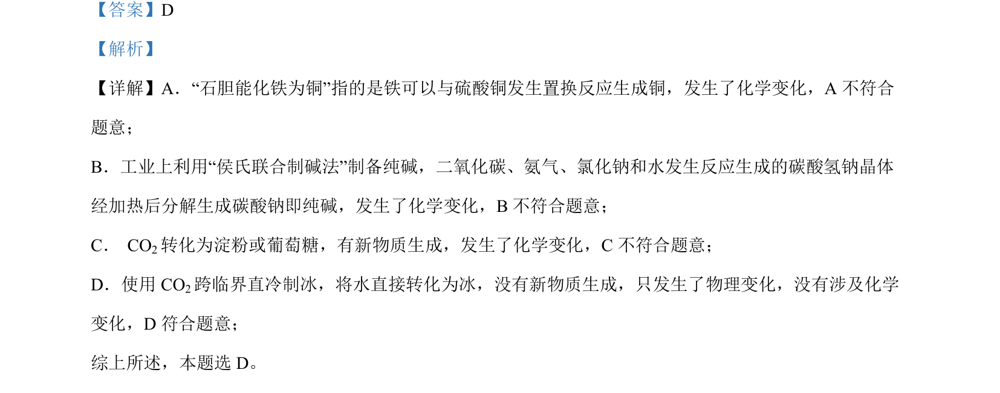

## 题面

## 摘要

该题考查物理变化与化学变化的辨析，涉及置换反应、纯碱制备、CO₂转化和干冰制冰等内容。

## 关联考点

- [[1000-物理变化与化学变化|物理变化与化学变化]]
- [[095-置换反应|置换反应]]
- [[纯碱制备]]

## 答案与解析

> 📄 原 PDF 第 1 页：`素材/真题/湖南/2008-2024·（湖南）化学高考真题/2022年高考化学试卷（湖南）（解析卷）.pdf`

<!-- 题干文本-start -->
## 题干文本
1. 化学促进了科技进步和社会发展，下列叙述中没有涉及化学变化的是
A. 《神农本草经》中记载的“石胆能化铁为铜”
B. 利用“侯氏联合制碱法”制备纯碱
C. 科学家成功将2CO转化为淀粉或葡萄糖
D. 北京冬奥会场馆使用2CO跨临界直冷制冰
<!-- 题干文本-end -->

<!-- 解析文本-start -->
## 解析文本
【答案】D
【解析】
【详解】A．“石胆能化铁为铜”指的是铁可以与硫酸铜发生置换反应生成铜，发生了化学变化，A 不符合
题意；
B．工业上利用“侯氏联合制碱法”制备纯碱，二氧化碳、氨气、氯化钠和水发生反应生成的碳酸氢钠晶体
经加热后分解生成碳酸钠即纯碱，发生了化学变化，B不符合题意；
C． CO 2转化为淀粉或葡萄糖，有新物质生成，发生了化学变化，C不符合题意；
D．使用 CO2跨临界直冷制冰，将水直接转化为冰，没有新物质生成，只发生了物理变化，没有涉及化学
变化，D 符合题意；
综上所述，本题选 D。
<!-- 解析文本-end -->
