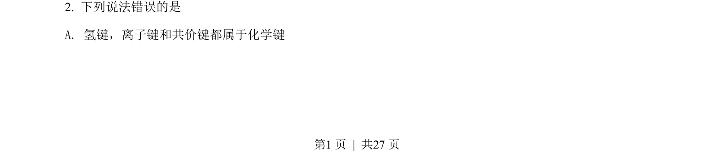
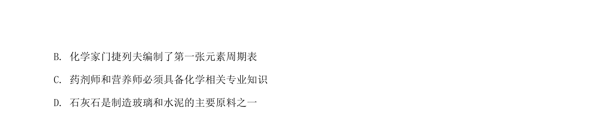
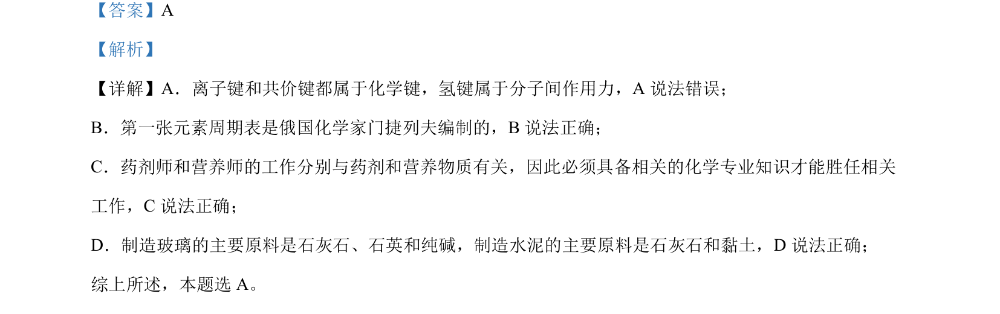

## 题面

## 摘要

考查化学基本概念与化学史、STSE知识，判断说法正误。

## 关联考点

- [[268-离子键|离子键]]
- [[255-共价键|共价键]]
- [[435-氢键|氢键]]
- [[253-元素周期表|元素周期表]]

## 答案与解析

> 📄 原 PDF 第 1 页：`素材/真题/湖南/2008-2024·（湖南）化学高考真题/2022年高考化学试卷（湖南）（解析卷）.pdf`
