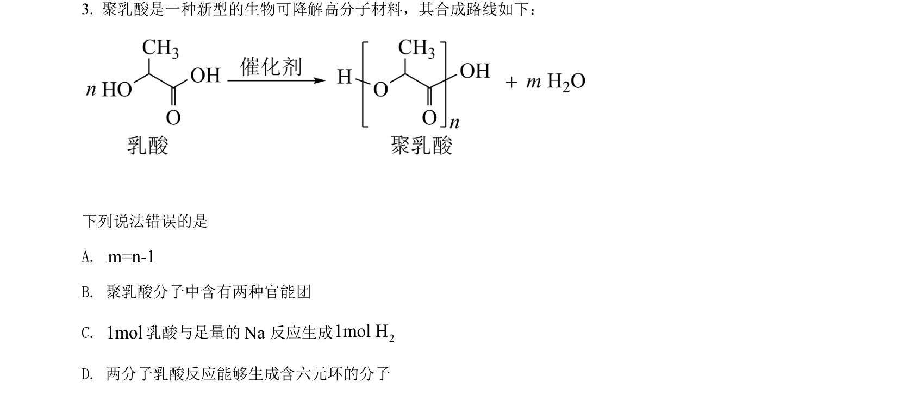
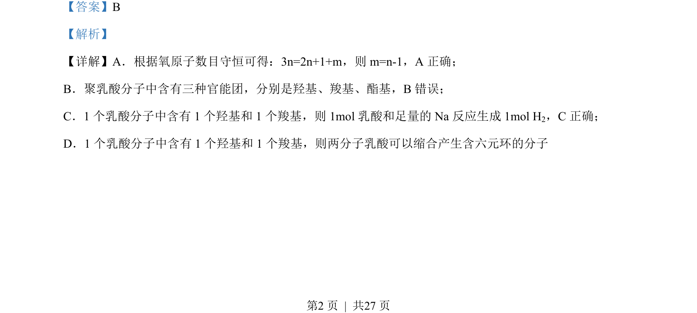
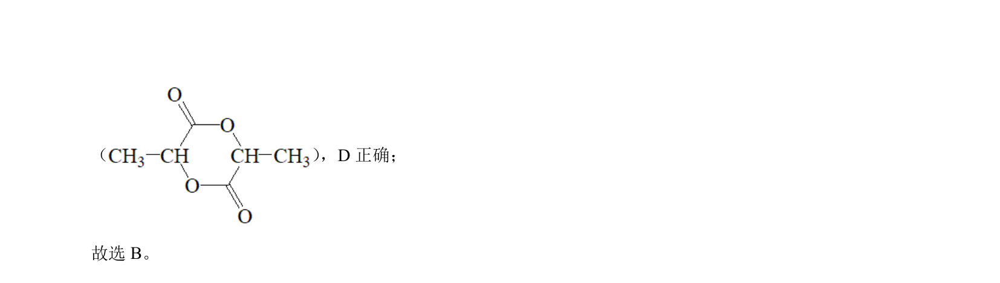

## 题面

## 摘要

考查乳酸及聚乳酸的结构、官能团与化学反应，判断说法正误

## 关联考点

- [[448-官能团|官能团]]
- [[有机反应]]
- [[627-化学计量|化学计量]]
- [[784-物质结构|物质结构]]

## 答案与解析

> 📄 原 PDF 第 2 页：`素材/真题/湖南/2008-2024·（湖南）化学高考真题/2022年高考化学试卷（湖南）（解析卷）.pdf`
