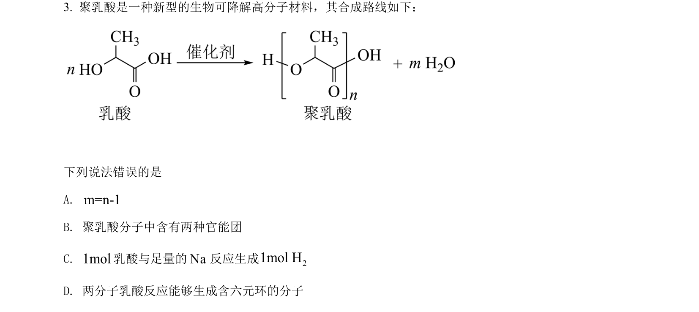
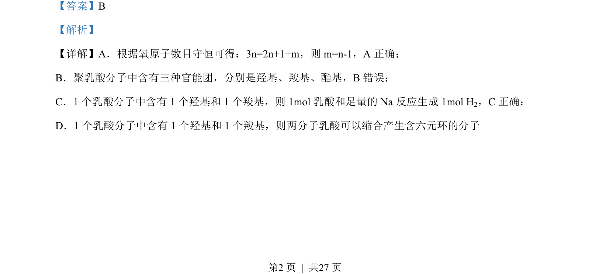
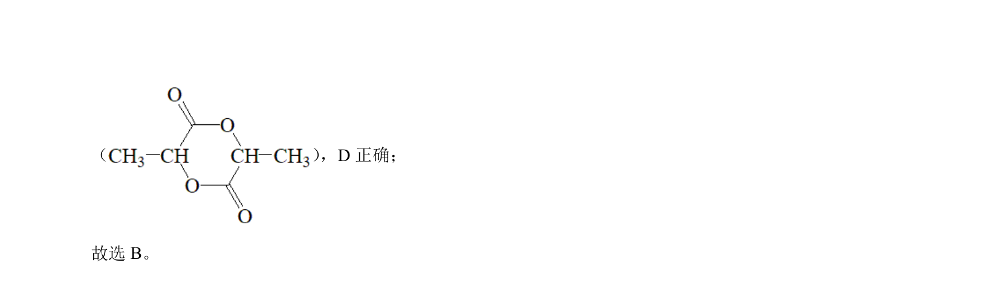

## 题面

## 摘要

考查乳酸及聚乳酸的结构、官能团与化学反应，判断说法正误

## 关联考点

- [[448-官能团|官能团]]
- [[有机反应]]
- [[627-化学计量|化学计量]]
- [[784-物质结构|物质结构]]

## 答案与解析

> 📄 原 PDF 第 2 页：`素材/真题/湖南/2008-2024·（湖南）化学高考真题/2022年高考化学试卷（湖南）（解析卷）.pdf`

<!-- 题干文本-start -->
## 题干文本
3. 聚乳酸是一种新型的生物可降解高分子材料，其合成路线如下：
下列说法错误的是
A. m=n-1
B. 聚乳酸分子中含有两种官能团
C. 1mol乳酸与足量的Na反应生成 21mol H
D. 两分子乳酸反应能够生成含六元环的分子
<!-- 题干文本-end -->

<!-- 解析文本-start -->
## 解析文本
【答案】B
【解析】
【详解】A．根据氧原子数目守恒可得：3n=2n+1+m，则 m=n-1，A 正确；
B．聚乳酸分子中含有三种官能团，分别是羟基、羧基、酯基，B错误；
C．1 个乳酸分子中含有 1 个羟基和 1 个羧基，则 1mol乳酸和足量的 Na反应生成 1mol H2，C正确；
D．1 个乳酸分子中含有 1 个羟基和 1 个羧基，则两分子乳酸可以缩合产生含六元环的分子
<!-- 解析文本-end -->
