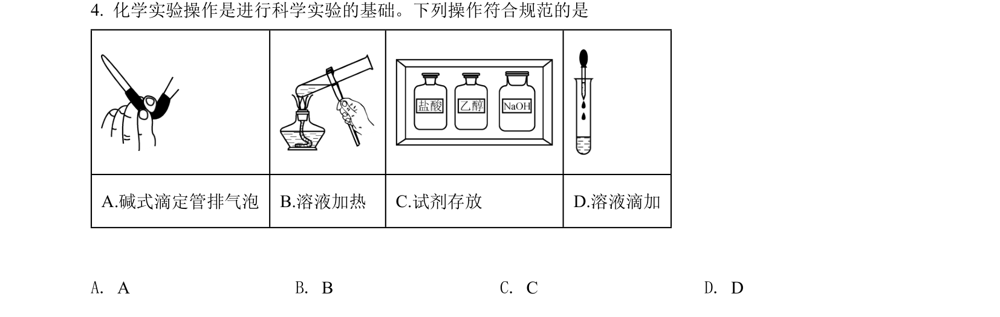
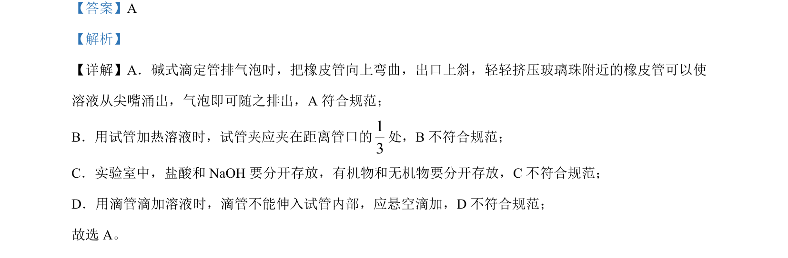

## 题面

## 摘要

考查化学实验基本操作规范及元素周期律推断与性质比较

## 关联考点

- [[995-实验基本操作|实验基本操作]]
- [[252-元素周期律|元素周期律]]
- [[635-原子半径比较|原子半径比较]]
- [[1004-非金属性比较|非金属性比较]]

## 答案与解析

> 📄 原 PDF 第 3 页：`素材/真题/湖南/2008-2024·（湖南）化学高考真题/2022年高考化学试卷（湖南）（解析卷）.pdf`
