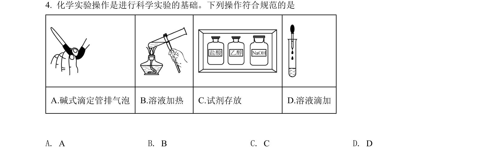
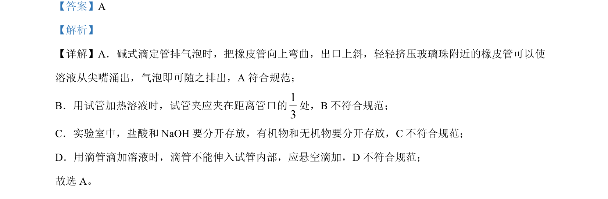

## 题面

## 摘要

考查化学实验基本操作规范及元素周期律推断与性质比较

## 关联考点

- [[995-实验基本操作|实验基本操作]]
- [[252-元素周期律|元素周期律]]
- [[635-原子半径比较|原子半径比较]]
- [[1004-非金属性比较|非金属性比较]]

## 答案与解析

> 📄 原 PDF 第 3 页：`素材/真题/湖南/2008-2024·（湖南）化学高考真题/2022年高考化学试卷（湖南）（解析卷）.pdf`

<!-- 题干文本-start -->
## 题干文本
4. 化学实验操作是进行科学实验的基础。下列操作符合规范的是
A.碱式滴定管排气泡 B.溶液加热 C.试剂存放 D.溶液滴加
A. A B. B C. C D. D
<!-- 题干文本-end -->

<!-- 解析文本-start -->
## 解析文本
【答案】A
【解析】
【详解】A．碱式滴定管排气泡时，把橡皮管向上弯曲，出口上斜，轻轻挤压玻璃珠附近的橡皮管可以使
溶液从尖嘴涌出，气泡即可随之排出，A 符合规范；
B．用试管加热溶液时，试管夹应夹在距离管口的13
处，B不符合规范；
C．实验室中，盐酸和 NaOH 要分开存放，有机物和无机物要分开存放，C不符合规范；
D．用滴管滴加溶液时，滴管不能伸入试管内部，应悬空滴加，D 不符合规范；
故选 A。
<!-- 解析文本-end -->
